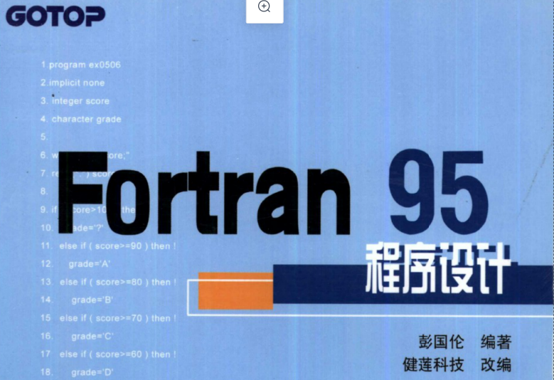
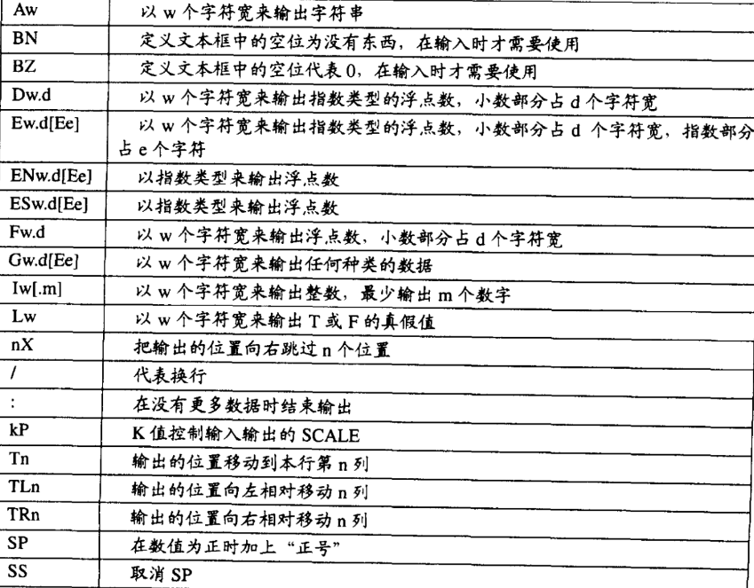
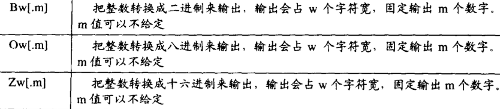

# fortran 笔记

# 经验总结

1. 一定要注意**自己设置的数组的大小**, 以及**传入的数组的大小**. 否则容易报错

2. 要十分注意 **变量是否被赋初值**  

3. 设置的 `subroutine` 的参数不能过长, 个数不能过多,  否则会报错

4. 对于一行有多个数据的, **`fortran 需要使用 隐式循环来读取, 不能是显示循环`**

5. 一定要将  值 返回出去, 否则保存的数据全是零

6. 在保证数组维度真确的情况下,  是不会报错,  =====> 已经到了文件底部.  

7. 注意 在通过循环赋值的时候, **`i_time`** 不要写成  **`time`** , 否则会出现乱乱七八糟的错误数据. 

8. 但一步步的数据检查都是正确的情况下, 可以看看自己写的保存数据的文件是否正确. 

9. **fortran字符串拼接: **   write(str,'(I1)') i_lat     *! 定义的前后的变量的长度必须是一样的, 否则报错.  而且如果定义的过长,*  ,  那么**前面空余的部分将被空格表示**\

10. 如果是 **字符串拼接文件路径** , 最好用  **`file=trim(filepath)`** , 这个`filepath ` 使我们在外部拼接好的路径. 

11. 当我们在计算散度 或者 涡度的时候 , 由于使用的是差分, 所以得到的结果要比 输入的  速度 的数组小两圈, 所以在定义数组大小的时候一定要特别注意,   否则我们按到的就不是真实的数据. 

    **一定要按照小了两圈的数组大小进行定义. **

12. 当于到fortran的无法分类的报错时候,  **如果是正在写的`subroutine`** , 可以先看看到底是不是当前函数的错误, 如果不是, 可以看看 上面和下面的 **`subroutien`** ,  也可能是它们漏了 `end subroutine `类似这样的语句. 

13. `fortran`在进行数组与数组之间赋值的时候, 一定要注意左右数组的维度的匹配.  形状必须一致.

14. `ceiling()`可以将将数字向正方向取整.   `flooring()` 可以向负方向取整. 


> 这是本人读书笔记, 基本上是照着书敲的, 目的是掌握fortran95 .




## 编辑器安装

> 本次使用 Ubuntu 中的vim来进行代码的编辑.  
>
> 1. 直接在终端输入 `sudo apt install gfortran` , 之后正常安装即可.
>
> 2. vim编辑器是Ubuntu自带的. 
>
> 现在就可以直接用 vim 来写fortran代码了. 

## Fortran编程简单规范

### 字符集

所谓的**字符集**也就是在写fortran代码的时候, 允许使用的字母和符号

```python
# 能够使用的字符如下:
1. 从 A 到 Z ,  已经从 a 到 z
2.  从 0 到 9
3.  一共22个特殊符号  : = + - * / () , . ' ! & % < > ? &  _ 空格   等
```


### 编写格式和要求

**注意:**

1. fortran **不区分大小写**

2. fortran的编码格式(书面格式)有两种: 

   1. **FreeFormat(自由格式)**, 其编写的程序文件后缀是 `.f90` , `.f95` 或者其他.

      自由格式要求编写代码的时候不是很严格, 编程起来很舒服, 但是也有一些注意点:

      1. **感叹号(!) **表示注释
      2. 每行可以编写132个字符
      3. **行号**放在每行程序的最前面
      4. 各行代码可以用 `&`符号进行连接. 比如一行代码写的很长的时候, 想在下一行继续编写, 就可以**在本行最后, 或者下一行开头**用 `&`

   2. **Fixed Format(固定格式)** , 其编写的程序文件后缀是`.for` 或者 `.f`

      `固定格式现在已经是旧版本的了, 并且编程时候需要严格按照要求来编写,个人感觉很麻烦, 现在人们大多用的是自由格式`


### 数据类型

fortran一共有五种数据类型

1. 整型(integer) .  分为**长整型**和**短整型**, 编码根据编译器的不同, 允许的整数范围也是不一样的. fortran的编译器有好几种呢.  一般也不用太在意类型. 了解即可.
2. 浮点型(float). 也就是小数. 分为**单精度**和**双精度**.  他们都有自己的最大允许的范围. 一般都是够用的, 不用太在意.
3. 复数型(complex) . 就是数学上的复数.  分为**单精度**和**双精度**
4. 字符型(character): 就是字符串. 记录n个字符串的字符串需要n个自己的内存空间
5. 逻辑判断型(logical): 也就只有两种结果 `True`或者 `False`.  通常 `1代表True` , `0d代表False`

在fortran中, 不同的数据类型, 存储方式也是不同的, 不必了解太细致,  我们编程的人会用就行.


```fortran
! 下面是fortran允许使用的数学表达式
加法    +
减法    -
乘法    *
除法    / 
次幂   **
括号   ()                    
```

**注意:**

1.  不用什么运算 ,  **用括号括起来的先运算**
2. fortran运算优先级是 **先乘除后加减**
3. 乘号不要省略, 有时候由于手写的习惯, 会将乘法的`*`省略. 这个在语法上会报错.


## 声明

### 普通声明

在使用变量之前, 我们需要对变量进行声明. 也就是开辟一段存储空间.

**声明规范:**

1. 声明可以用 `数字` , `下划线` , `26个英文字母`组成, 其他的字符都是不允许使用的
2. **一定要以`字母`开头**
3. **声明一定要放在可执行代码之前,  否则程序执行的时候找不到变量了, 会报错.**
4. Fortran是不区分大小写的, 声明的时候要注意.
5. 如果使用 `implicit none` , 那么声明就会遵从 `I N`规则, 也就是以从`I`到`N`的变量都是整型.  所以建议在 `program`的下一行使用 `implicit none` .
6. 使用 `parameter`定义的都是**常量**, 这些常量一旦定义, 之后就不能再改变, 也就是不能再进行复制了
7. 使用 `::` 可以给 **变量**赋初值, 变量之后仍然可以被赋予新的值. 
8. 使用`equivalence(a,b)` 进行**等价声明**, 等价声明使用**同一个内存位置**的变量, 只要改变其中一个变量, 就会改变其他变量的数值. 在一定的情况下, 等价声明可以 **节省内存,  精简代码**.

9. 如果一开始声明了一个整型的变量 `a `, 之后想让其参与到 浮点型的数字就算中, 那么可以使用 `real(a)` 来进行强制转换.  如果想转变为其他的类型, 可以像这样进行强制转换的. 

```fortran
program test
	implicit none
		real parameter :: pi = 3.14        ! 不能再进行改变了.
		integer :: a = 10                  ! 使用 :: 可以对变量赋初值, 之后根据需要, 变量仍然可以再赋值
		equivalence(a,b)                   ! 声明a ,b  为等价的, 它俩占用同一块内存.
		
    ! 下面是一些声明格式
    integer a            ! 声明变量a 是整型
    integer(kind=4) a     ! 声明长整型a , 赋值的时候使用4个bytes来保存数据 , 如果kind=2 那就是短整型
    integer a, b, c        ! 同时声明 a, b, c 三个整型
    integer:: a            ! 使用冒号, a就可以被赋初值了

    ! 其他的数据结构也是这样的声明的. 例如:
    real a
    real(kind=4) a 
    real(kind = 8) a


    complex :: aa, bb         ! 声明aa , bb
    aa = (1.0,2.0)            ! 对aa , bb 赋值.    
    bb = (1.0, 1.0)

    logical*4 dd 或者 logical(4) dd ! 可以这样规定变量的大小 , 但是没必要.

    character(10)    aaa        ! 声明 变量aaa为字符型, 并且长度为10字节
    character(len = 10) aaa      ! 也可以像这样指定长度.
end 																		
```

 对于 `character类型`, 有一些好用的函数:

1. `ichar`返回字符在计算机所使用的字符表中代表的编号 , 一般是ASCII码

2. `len(string)`返回字符串的长度

3. `len_trim(string)`返回字符串去除尾端空格的内容长度

4. `trim(string)` 去除`string`的尾端空格

5. `index(string, substring)` 返回`substring`在`string`中第一次出现的位置.

6. **很多时候不一定要指定`kind`** , 而且不同机器上, 指定同一个`kind`效果不一定相同. 如果想要查看具体要用哪个`kind` , 可以用 `selected_int_kind` , `selected_real_kind` 

   ```fortran
   integer, parameter :: long_int = selected_int_kind(9)  ! 得到如果想要记录9个位数的整数需要填写的kind值.
   integer(kind = long_int) :: a                          ! 这里就可以填入kind值了.
   ```


7. 还有一些进制转化的问题

   ```fortran
   ! 用 B , O , Z 可以实现将 二进制, 八进制, 十六进制 转化为十进制
   a = B"10"       ! 其实a = 2 , 因为二进制中的10 相当于十进制中的2
   a = O"10"       ! 其实 a = 8 , 因为 八进制中的10 相当于十进制中的8
   a = Z"10"       ! 其实a = 16 , 因为十六进制的10相当于十进制中的 16
   
   ```

   **注意:    在进行转化的时候, 我们需要用`B, Z , O`等, 并且`数字应该用引号包裹起来`**


### 自定义声明

有些时候我们需要自定义声明一些变量, 这有点像`python`中的 `class` , 在Fortran中具体可以这样:

```fortran
program test 
		implicit none
		! 开始自定义声明
      type :: person    ! 这个person是自己起的名字, 写代码的可以随便起一个名字
          character(len=30) :: name    ! 名字
          integer :: age                ! 年龄
      end type person
      
      ! 创建自定义声明  a
      type(person) :: a !      ! 这里创建了自定义声明变量 a 
      
      ! 声明完成后, 就可以开始写执行程序了
      read(*,*) a%age           ! 用百分号来使用自定义变量中的内容
      											 ! 此处使用 a中的 age  , 运行程序的时候, 我们可以给其一个值
      
      b = person("张三", 20)    ! 可以这样创建变量, 并赋值.  不过赋值的时候需要注意顺序. 
      
end 
```


## 输入输出

### write, print , read

> **输出**可以用 `write`或者`print`
>
> **输入**用 `write` , `read`

```fortran
! 请看下面简单的的代码
program test              ! program 关键字表示主程序,  test是我们自己给程序起的名字
		integer :: a
    write(*,*) "Hello World"    ! 最终, 我们可以打印出 hello
                               ! 想要输出的内容直接用 双引号括起来就行.
                               ! 如果还想同时输入其他的字符串, 那就 用逗号分隔
                               ! write 的第一个星号 表示输出位置,  默认是屏幕, 可以指定其他地方, 例如: 文件
                               ! write的第二个星号表示 输出格式, 这个也是可以通过自己进行调整的.
	
	print*, "Hello World"        ! print只能输出到屏幕中, print的星号表示输出格式.
	
	read(*,*) a                   ! 程序运行后, 此处可以让用户输入一个整数.
														! read的两个星号和write代表的意义一样.
														! 如果read后面跟着多个变量, 那么输入的时候就要用 空格, 逗号 或者按 Enter键
														! read输出的变量一定要符合声明的变量类型, 例如:整数型就填整数, 字符串就填写字符串.
	
end                       ! 必须给出 end , 表示主程序结束.
```

**注意: **

1. Fortran中的`program` 并不是不许有的, 但是推荐使用, 因为在实际需要一个主程序和其他的子程序相互配合. 如果不写`program` , 那么容易报错.
2. 如果是**两个整数**进行相除, 那么最终结果只会保留整数部分, 最终结果如果有小数部分, 会被自动删除.  如果想用` 1/3 `的话, 应该将其写为 `1.0/3.0`
3. 在进行读取的时候, 多给出的部分不会报错, Fortran会根据空格, 逗号等断开, 多出的部分会被自动舍弃.


### 格式化输入输出

用`format`命令进行格式化 , 也可以使用 `"()"` 进行格式化

```fortran
program test
		integer a
		a = 100
		write(*,100) a          ! 这里的100 表示 按照标号100 的格式进行输出
		write(*,"(I4)") a
		100 format(I4)          ! 这里设置了 格式 I4 , 表示以4个字符输出整数
												 ! format 最好放在靠近write的附近, 这样方便寻找格式.
												 ! 如果设置的输出长度要小于实际的输出, 那么输出的就是 星号
												 
		print 100 a           	 !使用 格式 100
		print "(A10)", "Hello"    !固定10输出10个字符, 输出Hello

end 
```

**下面是格式的规范:**





**注意: 如果在读取的时候, 读取的内容中间有个逗号, 那么 最好使用格式输出 , 例如用`A` 来固定输出长度, 这样 空格, 逗号之类的也可以被包含在读取的内容中**


## 流程控制与逻辑运算

### 逻辑和关系运算符

这些逻辑运算符是为了能够书写判断条件做准备的

| 符号            | 作用                  |
| --------------- | --------------------- |
| == 或者 `.eq.`  | 判断是否"相等"        |
| /=  或者 `.ne`  | 判断是否 "不相等"     |
| > 或者 `.gt.`   | 判断是否 "大于"       |
| >=  或者 `.ge.` | 判断是否 "大于等于"   |
| <   或者 `.lt.` | 判断是否"小于"        |
| <= 或者 `.le.`  | 判断是否 "小于或等于" |
|                 |                       |


| 关系运算符 | 作用                                               |
| ---------- | -------------------------------------------------- |
| `and.`     | 交集, 两边条件必须都成立                           |
| `.or.`     | 并集, 两边条件只要有一个成立就行                   |
| `.not.`    | 逻辑反向, 如果后面的表达式不成立, 整个表达式就成立 |
| `.eqv.`    | 两边表达式逻辑运算结果相同时,  就成立              |
| `.neqv.`   | 两边表达式逻辑运算结果不同时, 整个表达式就成立     |

注意: 

1. 关系运算符两边条件最好都**用括号括起来**.

2. 有个很特别的, 如果 `A .neqv. B `, A 和 B的逻辑判断都是 `False` , 那么最终返回结果是`False`


### IF语句

```fortran
! if语句书写格式如下:

if (判断条件) then           ! 最好将判断条件用 括号括起来.

		! 条件成立时, 执行其中的代码
		
elseif  (判断条件) then      ! 上一个条件不成立, 在此处判断这个条件是否成立

		! 条件成立时, 执行其中的代码
else                      ! else其实可以省略不写的.也可以写

		! 条件不成立时, 执行此处的代码.  
end if 
```


1. 如果判断的条件和执行内容都很简单, 那么可以将`if`语句写成一行

```fortran
if (a> 100) write(*,*) "满足条件, a>100"
```


2. `if`语句可以嵌套`if`语句的.
3. 要避免用`==`来对 **浮点数** 做逻辑判断, 因为计算机对小数部分总有误差, 导致得到的结果不是很好
4. 字符串或者字符也是可以进行逻辑判断的,  它们比较的标准就是**字符对应的ASCII码**. 通过字符串的第一个, 第二个, 第N个字符逐个比较大小.如果第一个大, 那后面就不用比了, 如果第一个相同, 在比较第二个, 以此类推.


### Select Case 语句

```fortran
! select case 格式如下:

select case(变量)
	case (数值1 或者某段数值范围)
			! 满足上方的数值条件, 执行此段代码
	case(数值2 或者某段数值范围)
			! 满足上方的数值条件, 执行此段代码
	case(数值n 或者某段数值范围)               
			! 满足上方的数值条件, 执行此段代码
	case default
		
end select

```

`case`中的条件可以这样书写

`case(1)` 变量等于 1 时, 成立

`case(1,2,3)`变量是 1 或者 2 或者 3 其中的一个时, 就成立

`case(1:5)` 变量大于等于1 , 小于等于5的时候成立

`case(1:)` 变量大于等于 1的时候成立

`case(:5)`变量小于等于5的时候成立

**注意:**

1. `case`中**只能使用 整数, 字符, 逻辑变量, 不能使用 浮点数和复数**
2. `case`只能使用 `常量` , 不能使用变量.


### goto语句

这种语句能够实现从一段代码跳转到另一段代码, 很多人是不建议使用的. 因为它破坏了程序的可读性. 


### pause语句

执行`pause `的时候, 程序会暂停执行, 用户可以用` Enter`键来使得程序继续执行.


### continue语句

没啥意义, 意思是让程序继续执行, 实际中用的不多. 相当于python中的`pass`


### stop语句

`stop`是用来终止程序运行的.


## 循环

### do循环

`do循环`格式如下:

```fortran
program test
		implict none
  			int :: i
     		 do i = 1 , 20 , 2           ! 循环从1 到 20 , 每次步长为2
          	write(*,*) "Come on"   
         end do 
end 
```

**注意: `do循环`中可以嵌套`do循环`**. 这是实际中经常用到的


### do while循环

根据 **判断条件是否成立** , 决定循环是否要继续执行

```fortran
do while (条件)     ! 条件最好用括号括起来
	! 此处是 条件成立的情况下, 要执行的代码.
end do 
```

**注意: 如果 用 `do while(.true.)` 条件永远成立, 那就是一个死循环.**


### 署名循环

其实就是给循环起个名字, 格式如下:

```fortran
cycle_name : do i = 1,3
		! 这里是循环时要执行的代码
end do cycle_name
```


### cycle语句

`跳出当前循环, 直接进行下一次的循环`


### exit

用来终止整个循环的.  如果是嵌套循环, 那么会终止`exit`所在的循环, 凡在内循环那就是终止内循环, 放在外循环, 那就是终止外循环.


## 数组

### 数组的声明

数组声明格式如下:

```fortran
! 第一种声明格式:
real :: arr2(5)   ! 这个数组能放5个实型的数字  


! 第二种声明格式:
real , dimension(10) :: a      ! 声明了 a 可以填入1个实型数字

! 第三种声明格式:
real a                         ! 这样也可以声明数组 a , 可以填入10个实型数字.
dimension a(10)
```

**注意: ** 

1. 数组声明的时候只能在括号中放入 `常量` , 比如上方的 `5`.

2. 如果想要定义一个二维的数组, 方法和上方一样, 只是括号中填入的值不一样. 例如:

   ```fortran
   integer a(3,3)         ! 创建了一个3行, 3列的数组.
   ```

3. 如果先定义更多维度的数组, 括号内只需要, 用逗号分隔开就行.  

4. **fortran最多可以定义`7维数组`**

5. **正常情况下, `fortran数组索引是从 1 开始的`**, 如果向改变开始索引, 可以这样:

   ```fortran 
   integer :: a(0,3)      ! 数组索引从0开始.
   integer :: b(-1,2)     ! 数组索引从 -1 开始.
   ```

   

### 数组的赋值

```fortran
!第一种赋值方法:  data语句
integer :: a(5)
data a  /1,2,3,4,5/               ! 将 1,2,3,4,5 赋值给了数组a
```

```fortran
!第二种赋值方法:   data语句的 * 代表重复
real :: a(5)
data a /5*1/        ! 将5 个 1 赋值给数组a
```

```fortran
!第三种赋值方法    data语句的隐含式赋值
integer :: i
real :: a
data(a(i), i = 2,4) /11, 22, 33/   ! i会从2 循环到 4 , 然后将11, 22, 33 分别放入索引为2, 3,4 的位置,
```

```fortran
!第四种赋值方式  , 其实就是第三种, 循环赋值
integer a(2,2)
integer i, j
data(((a(i,j),i=1,2),j=1,2)/1,2,3,4/    将1,2,3,4 依次赋值给a(1,1), (2,1), (1,2),(2,2)
```

```fortran
!第五种赋值方式
integer :: a(5) = (/1,2,3,4,5/)
```

```fortran
! 第六种赋值方式
integer:: i
integer :: a(5)= (/1,(2,i = 2,4), 5/)   

! (2,i = 2,4) 表示的是 a(2), a(3) , a(4)  都被赋值为 2
```


### 数组元素的处理

#### 普通循环处理

1. 数组在赋值后就可以进行一些运算, 一个很常见的做法是 数组和循环结合

```fortran
!假设 n ,m , a,b,c 已经声明 
do i= 1,n
	do  j = 1,m
		a(i,j) =  b(i,j) - c(i,j)   ! a,c对应的元素实现 + , - , *  , /
	end do 
end do
```


#### where语句

1. `where`语句 , 格式如下:

```fortran
where (a<3))
	b = a            ! 将 a < 3 的值都赋值给b
end where
```


```fortran
where (a<2)
	b = 1
	
elsewhere(a>5)
	b= 2
	
elsewhere
	b = 3         ! 相当于设置了2<=a<=5  

end where
```


2. `where`也是可以取名的

```fortran
myname: where(a<5)
	b = a
end where myname
```


3. `where`是可以嵌套使用的

```fortan
where (a<5)
	where (a>2)
			b = a     
	end where
end where
```


#### forall语句

1. `forall`实现单循环

```fortran
forall(i= 1:5)
	a(i) = 5
end forall
```


2. `forall`实现双循环

```fortran
forall(i = 2:10:2, j=1,5 ,( a(i,j)<10) )  ! i 从2到10 , 步长为2 ;  j从1 到5, 默认步长为1
		a(i,j) = i+j                       ! 满足判断条件 a(i,j) < 10 的执行代码
																	 ! 建议把 判断条件 用括号括起来
end forall
```


3. `forall`中的`i==j `, 便于处理方阵的对角线元素

   ```fortran
   forall(i=1:5, j= 1:5, i == j)
   		a(i,j) = 1         ! 只处理 i = j 的情况.
   end forall
   ```


4. `forall`语句是可以写在一行的

   ```fortran
   forall (i = 1:5 , j = 1:5), a(i,j) /= 0 a(i,j) = 1/(a(i,j))) 
   ```

   

   

### 动态的数组

在一开始不知道数组的维度的时候, 或者 数据比较大, 占用内存比较多, 使用完数组后, 想要删除数组. 这是可以采用 **动态数组**. 

```fortran
program test
		implicit none
		
		integer :: students 
		integer ,  allocatable :: a(:)          ! 声明一个大小可变的一维数组
		! integer , allocatable ::b(:,:)          ! 声明一个二维的数组
		integer :: i 
		
		write(*,*) "Come on!"
		read(*,*) students
		allocate(a(students)) !                     ! 分配内存
		
		! 此处可以对数组a进行一些操作
		
		deallocate(a)                                !  删除数组

end 
```


如果想要检查数组有没有被分配内存, 可以使用 `allocated`

```fortran
allocated(a)      ! 检查数组a是否被分配内存
```


### 数组的应用

1. **排序**, 将一个一维数组的按照**从小到大进行排序**

   ```fortran
   do i = start , size-1
   	do j = start+1, size
   		if(a(i) > a(j)) then
           t = a(i)
           a(i) = a(j)
           a(j) = t
   		end if
   	end do
   end do
   ```

   

fortran中有很多继承了MATLAB中的一些函数, 在实际应用中, 只需要导入库, 就能很方便的时候. 所以在进行一些特殊算法计算的时候, 可以到网上查一查, 看看有没有能用的函数.


## 函数

### 子程序(subroutine)

书写格式: **在主程序外书写`subroutine` , 使用`call` 调用函数**

```fortran
program test
		implicit none
		call message()         ! 使用call调用子函数	

end 


! 可以在主程序外编写子程序
subroutine message()
	implicit none  
	! 这里可以定义变量
	
	! 这里还可以 编写要执行的内容

end subroutine message
```

**注意:**

1. 如果子程序的最后执行的是`stop`命令, 那么主程序在调用并执行以后, 整个程序都会被结束,  所以建议`subroutine`的 最后, **不要使用`stop`**

2. **主程序和子程序的`变量` , 互不相干.  也就是说主程序中的变量不是全局变量. **
3. **主程序和子程序的行代码也是互不相干的**, 例如, 主程序和子程序各自定义了一个标号为 `100`的`format`格式, 那么在使用的时候, 两者互不影响.
4. fortran 传参使用的是 **传址调用**


### 自定义函数(function)

> **注意:**
>
> 1. 自定义函数调用前, 需要声明, 并且在`function`内部也要声明自己的类型
> 2. 自定义函数执行后会返回一个**数值**
>
> **一般情况下, 还是用 `subroutine` 方便**

书写格式如下:

```fortran
program test
		implicit none
		real , external :: add   ! 声明自定义函数 add ,
    											! 其实可以不用external, 那是建议使用 , 便于和变量区分开来.
		write(*,*) add()         ! 自定义函数在声明后, 就能直接调用


end 


! 可以再主程序外编写自定义函数
function add()
		implicit none
		real :: add          ! 自定义函数最终返回的就是 real
		
		! 这里是要执行的代码

end 
```


### 全局变量(common)

**注意: **

**`common`是在主程序之前就自动被调用的**

**使用`common`的时候, 一定要注意变量声明的类型要一致**

书写格式如下:

```fortran
program test
	implicit none
	real :: a,b
	common a, b          ! 声明a, b是全局变变量
	
	
end 

subroutine my_commmon()
	implicit none
	real :: aaa, bbb          ! aaa , bbb 分别对应主程序中的 a, b . 顺序一定不能乱.
	common   aaa, bbb
	


end subroutine my_commmon
```

在使用的过程中 `a` 和 `aaa` 是对应的, 它们使用的是同一个地址, 一旦有一个被赋值, 另一个的值与其也是相同的. 同样的`b` 和 `bbb`是对应的, 它们使用的也是同一块地址. **顺序一定是一一对应的.** 并且**赋值的时候也是挨个赋值, 不能够跳跃,**也就是说, **只有`a`**或者`aaa`被赋值了,  才能轮到`b`或者`bbb`被赋值.


```fortran
! common 定义的全局变量还可以放在 某个 组中 , 大概格式如下:

 integer :: c , d
 common /group1/ c,d        ! 这样 c , d 都被放在group1的全局变量空间中了.
 
```


**无论怎样定义 `common ` 全局变量, 赋值的时候, 不能用直接用 `data` 赋值, 要用 `block data 模块`** .  

```fortran
program  test
		implicit none
		
		! 这里是主程序的代码

end

block data
	implicit none 
	integer a , b     ! 除了主程序和子程序中的,  这里也需要再次声明变量.
	common a,b 
	data a,b /1,2/      ! 给 a, b 赋初值.
	
end block data


```


### 函数中的变量

**注意**:

1. 传递的参数类型一定要一致, 比如`subroutine(a)` , 如果`a`在主程序中是 `real型`, 那么在子程序中也要是`real`. 每种类型的数据解析和存储的方式

   是不同的, 所以如果类型不同, 那就会报错.

2. 输入`常量`作为参数的时候, 要确保子程序不会修改其值, 因为`常量的值是不能改变的`

3. 只有在子程序被调用的时候, 子程序的变量才会存在, 否则子程序中定义的变量就会被清楚. 如果想要 **保留子程序中的变量, 可以使用`save`**

   大致的编写格式如下:

   ```fortran
   subroutine aaa()
   	implicit none
   	integer :: count = 1
   	save count             ! 之后count 变量得到的数据会一致存在,
   
   	! 或者可以写成一行
   	integer , save :: count2  = 1
   
   end
   ```


4. 在`subroutine`中, 可以通过`intent(in) `设置传入的参数中只能读,  `intent(out)`指定变量重新赋值

   ```fortran
   real , intent(in) ::  a  ! 指定传入的参数a只能读
   
   real, intent(out)  ::b ! 指定参数b在子程序中应该被重新设置数值
   ```

   

5. `interface`可以用来指定接口, 具体使用可以上网搜索

6. `subroutin`的**可选参数**可以这样设定:

   ```fortran
   real , optional :: b       ! 指定 参数 b 是可以不传的, 当然也是可以传进来的
   ```

   

7. 用 `present(要检查的参数)` 来检查, 某个变量是否传入.
8. 调用子程序的时候可以这样 `call my_subroutine(c = 1, b= 2, a =2)` , 假如原本设置的顺序是 a, b,c  那么像上面这样传参可以的, 不用按照顺序传参.
9. `contains` 可以用来设置主程序中的内部函数


### 特殊的函数

> **下面的函数只做介绍, 具体使用都是可以上网搜到的**

1. `recursive`放在函数前的, 函数通过它可以实现递归.
2. `elemental` 用来作 并行运算的, 但是用起来有很多限制条件.

3. `entry` 直接进入另一个调用点, 

4. `return`用来返回值的

   ```fortran
   call sub(a,*100, *200)
   ! a 就是第一个折返点 , *100 就是第二个折返点 , *200 就是第三个折返点
   
   return     ! 返回的是默认返回值 a
   
   reurn ` 1    ! 返回的是参数*100
   
   reurn ` 2    ! 返回的是参数*200
   ```


### module简单介绍

说白了, 就是能够更加方便的使用 变量.

````fortran 
module global
	implicit none
	integer a, b
	common a,b
end module

program test 
	use global           ! 此处使用 use global 就行, 不必声明变量
	implicit none
	! 代码中可以直接使用 a, b变量
end


subroutine sub()
	use global               !  此处使用 use global 就行, 不必声明变量
	implicit none
	! 代码中可以直接使用 a, b变量
end subroutine sub
````


`module`中的自定义类型 `type`

```fortran
module constant
	implicit none
	real, parameter :: pi = 3.14
	real, parameter  :: G = 9.8
end module

module typedef
	implicit none
	type player 
		real ::angle
		real :: speed
		real :: distance
	
	end type

end type

program test
	use typedef
	implicit none 
	real , parameter :: players = 3
	type(player) :: people(players) = ( /player(20, 25, 0), &
																player(20, 25, 0), &
																player(20, 25, 0)/
																
	
	)


do i = 1, players
	write (*,*) people(i) distance
end do 
	
end 


! subroutine 和 program的写法一样, 只是, 使用的是subroutine


```


## 使用多个文件

需要将不同的文件放在**同一个目录**下才行.

在一个文件中, 调用另一个文件的函数, 可以这样:

```fortran
program test
	implicit none
	call sub()          ! sub是另一个文件的函数
end

include 'otherfile.f90'      ! 插入另一个文件的名字
```


下面是另一个文件(`otherfile.f90`)的内容: 

```fortran
subroutine sub()
	implicit none
	write(*,*)  "Hello"
end subroutine 
```


## 文件的读取

### 读取和保存格式

**文件读取方式:**

1. 顺序读取,  也就是一条一条的读取
2. 直接读取, 也就是可以跳越着读取


**文件保存格式**:

1. 文本文件
2. 二进制文件


### open的使用

想要将内容写入文件, 可以这样:

```fortran
open (unit=10, file= "文件的路径/test.txt")   !键内容保存到 test.txt
		write(10,*) "Hello World"  ! 被写进去了
```


**`open` 由很多参数**, 如下:

```fortran
unit= 10 			 ! 指定打开的文件号, 之后利用write 来写入
							! 这个文件号最好不要是 个位数, 因为可能与默认值冲突
							
file          	! 用来指定打开的文件路径

form             ! 指定保存的格式
							 ! form = "formatted"  以文本文件方式保存 , 这也是默认的保存方式
							 ! form = "unformatted"  以二进制文件方式保存
							 

status           ! 用来指定打开的文件是新文件还是旧文件
							 ! status = "new"   表示文件不存在, 第一次打开
							 ! status = "old"   表示文件已经存在
							 ! status = 'replace'  如果文件存在, 则重新创建文件, 并且原来的内容会消失
							                       !如果文件不存在, 那就会创建新文件

							! status = 'scratch'  表示要打开一个暂存盘, 临时保存数据, 此时 file可以忽略.
              	! status = 'unknown'  由编译器自定义, 通常会同replace效果, 默认就是 unknown
              	
access          ! 设置文件读取的方式的
							! access = 'sequential'    表示顺序读取,  这也是默认的读取方式
							! access = 'direct'        表示直接读取
              
recl = length   ! 在顺序读取中,  用来指定每次可以读写多大长度的数据

err = label      !当文件打开发生错误时, 程序会跳跃到 label指定的代码来执行程序

iostat = var     ! 用来说明文件打开的状态
							 ! var > 0  表示读取发生错误
							 ! var = 0  表示正常读取
							 ! var < 0  表示 文件终了

blank           ! 是对输入的内容中含有的空格进行处理
							! blank = null'  空格代表空, 
							! blank = "zero"     表示空格会被0代替
							
position        ! 指定文件打开时, 开始读取的位置
						  ! position = 'asis'     ! 不特别指定位置, 一般是开头, 这也是默认值
						  !position= 'rewind'     ! 指定读取位置移动到开头
						  ! position = 'append'    ! 文件打开时的读取位置移到文件的结尾

action = 'readwrite'  ! 打开的文件, 可读可写
action = 'read'        ! 只能读
action = 'write'       ! 只能写

pad                    ! pad = 'yes'在格式化输入时，最前面的不是字段会自动以空格填满，默认值是pad = 'yes'
										! pad = 'no' , 在格式化输入时,不是字段不会用空格填满

delim                   ! delim = 'none' 纯粹输出字符内容
										 ! delim = 'quote'  用双引号包裹输出内容
										 ! delim = 'apostrophe' 用单引号包裹输出内容

```


### write和read的使用

下面介绍**`write`或者`read`**的用法, 两者具有的属性基本上相同

```fortran 
unit          ! 用来指定输入到哪文件,  unit=10 输入到第10号文件

fmt = format  ! 用来指定输出格式

nml           ! 指定namelist 的内容

rec           ! 在直接读取文件中, 设置索要读写的文件模块位置

iostat        ! 设置文件读写状态

err           ! 指定读写过程中发生错误, 跳转到某个行代码来继续执行

end            ! end = label     读写到文件末尾的时候, 跳转到某一行, 继续执行

advance       ! 用来指定是否换行的
              ! advance = 'yes'   , 表示没读写一次就会向下移动一行. 这是默认的
              ! advance = 'no'    , 表示读写一次后, 暂停换行操作.
              
size = count  ! 只有advance = 'no' 的时候使用, 作用是输出的字段数目, 传给后面的整型变量
**`inquire`**
```


### 文件查询inquire的使用

**`inquire`**是一个用来查询文件状态的命令, 如果想要使用,  可以直接用浏览器搜索如何使用


### 其他命令的使用

`backspace(unit = number, err=errlabel, iostat=iostat)` 将文件读写位置退回一步, 其他字段参考上一节.


`endfile(unit=number, err = errlabel , iostat = iostat)` 将目前文件的读写位置变成文件的结尾


`rewind(unit=number, err=errlabel , iostat=iostat)` 将文件读写位置指定到文件开头


`close(unit = number, status = string , err= errlabel, iostat=iostat)`将文件关闭, 不在继续对文件进行操作, 其中

```fortran
status = 'keep'    ! 会在文件关闭后保留这个文件, 这是默认值
status = 'delete'  ! 文件关闭后, 删除这个文件
```


### 顺序文件的操作

顺序文件是不能任意赋值到文件的某个位置的, 只能一步步的从头到尾的操作

但是可以:

1. 一步步的倒退
2. 直接回到文件开头


## Module和面向对象

### Module作用

> 1. Module可以声明变量, 经常用来说声明程序中所需要的常量或用来存放全局变量
> 2. Module里面可以定义自定义类型. 在经过use命令让程序中的每个函数都能使用这个类型
> 3. Module里面可以编写函数, 通常会把功能相关的函数放在同一个Module里面, 在Module外面调用这些函数, 同样适用use命令
> 4. Module里面的函数, 可以直接使用同一个Module总所声明的变量. 所以Module里面的函数, 可以经过Module里面的变量来相互传递参数.


### Public 和 Private

```fortran
! 这里是定义module部分
module bank
    implicit none 
    private money                           ! 使用了 Private 属性,money 只能在 bank moudle中使用 
    public LoadMoney , SaveMoney , Report   ! 使用了Public 属性, 可以再 module外被调用.

    integer :: money = 100000

contains 
    subroutine LoadMoney(num)
        implicit none  
        integer :: num 
        money = money-num
        return 
    end subroutine

    subroutine SaveMoney(num)
        implicit none
        integer :: num 
        money = money + num 
        return 
    end subroutine

    subroutine Report()
        implicit none 
        write(*,"('银行目前存款:', I, '元')") money 
    end subroutine

end module


! 下面是使用 Module 部分
program  test
    use bank    ! 使用 module
    implicit none  
    call LoadMoney(100)
    call SaveMoney(1000)
    call Report()


end 

```


### Use的使用

1. 使用MODULE的数量并没有限制，可以同时使用好几个MODULE,只要多写几个USE就行了。

   ```fortran
   module A 
       implicit none 
       integer :: a,b 
       
   end module
   
   module B 
       use A                    ! 在 module 中 使用 module 
   
   end module
   
   subroutine sub()
       use B                    ! 在函数中使用 moudle B
   end subroutine sub
   ```

   

2. 同时使用多个MODULE时，可能会遇到变量名称或是函数名称重复的问题。USE命令后面，可以临时把MODULE里面的变量或函数名称改名。

   ```fortran
   module A 
       implicit none 
       integer :: va 
       
   end module
   
   module B 
       implicit none 
       integer va   
   
   end module
   
   Program test
       use A , aa => va   ! 将 moudle A 中的变量va 改名为 aa
       use B 
   
   end 
   ```


3. 只用module中的某些东西, 而不是全部的模块 , 直接用`only`

   ```fortran
   module A 
   	implicit none
   	integer va , vb, vc
   	
   end module 
   
   module B 
   	implicit none
   	integer va , vb
   	
   end module
   
   program test
   	use A , only : vc  ! 使用module 中的变量vc
   	implicit none
   	! 其他的代码
   
   end 
   ```

4. 使用 `only`也可以直接改名

   ```fortran
   program main
   	use A , only : c => vc  ! 只用module A中的变量vc 
   	                         ! 并且 vc改名为 c
   
   	use B 
   	
   	implict none 
   	! 其他的代码
   	
   end 
   ```

   

5. 在module A中使用module B,可以想像是module A继承了module B的数据和函数。不过继承的东西**只限制在module B中对外公开的变量及函数**，module B所**私下使用的东西不会被继承**。module A继承module B的原有功能之后，**可以再添加一些函数来扩充功能**。

   ```fortran
   module ma
   	implicit none
   	real a,b
   	contains
   	subroutine getx()
   	write(*,"('x=',F5.2)") -b/a
   	return 
   	end subroutine
   end module
   
   module mb
   	use ma
   	implicit none
   	real c
   contains
   	subroutine getx2()
   	real a2,d,sqrt_d
   	a2 = 2*a 
   	d = b* b-4*a*c
   	if(d>=0) then 
   		sqrt_d = sqrt(d)
   		write(*,"('x=',F5.2,',',F5.2)")
   	else
   		write(*,*) '无实数解'
   	end if 
   	end subroutine
   end module
   
   subroutine sub1()
   	use ma
   	implicit none
   	a = 2.0
   	b = 3.0
   	call getx()
   	return
   end subroutine 
   
   
   subroutine sub2()
   	use mb
   	implicit none 
   	a = 1.0
   	b = 4.0
   	c = 4.0
   	call getx29)
   	return
   
   end subroutine
   
   program main
   		implicit none
   		call sub1()
   		call sub2()
   end program
   ```

   

### Interface 的使用

1. **同名函数的重载(`overlaod`)** 

   `overload`的意义是：“在程序代码中可以**同时拥有多个名称相同，但是参数类型、数目不同的函数**，程序会自动根据输入的参数，来决定要调用哪一个函数”。

   ```fortran
   module ma
   	implicit none
   interface show       ! 虚拟的函数名称 show
   	module procedure show_int     ! 等等待选择的函数 show_int
   	module procedure show_character  ! 等待选择的函数 shwo_character
   end interface
   
   
   contains
   	subroutine show_int(n)
   		implicit none
   		integer , intent(in) ::n
   		write(*,"('n=' , I3") n
   		return 
   	end subroutine show_int
   	
   subroutine show_character(str)
   	implicit none
   	character (len=*) , intent(in) :: str
   	write(*,"('str=',A)")str
   	return
   end subroutine show_character
   
   end module 
   
   program main
   	use ma
   	implicit none
   	call show_int(1)
   	call sho(1)             ! 输入的参数是整数, 会自动调用show_int
   	
   	call show_str("I am str")
   	call show("I am str")    ! 输入的参数是字符串, 会自动调用字符串
   	
   end
   	
   end program 
   ```


**progudce**

还是**同名函数**,  使用  **`module procedure`**  可以实现**传入的参数个数不同**. 

例子:

```fortran
module ma
	implicit none
	interface getx
    module procedure getx1          ! 使用 module procedure 可以实现参数个数不同
    module procedure getx2
  end interface
  
 contains
 		subroutine getx1(a,b)        ! 传入了两个参数
      real a, b
      write (*,"('x=', F5.2)") -b/a
      return 
 		end subroutine getx1
 		
 		subroutine getx2(a,b,c)      !传入了三个参数
 			real a, b, c
 			real a2, d, sqrt_d
 			a2 = 2*a
 			d = b*b - 4*a*c
 			if (d>=0) then 
 					sqrt_d = sqrt(d)
 					write(*,"('x=',F5.2,',',F5.2)")(-b_sqrt_d)/a2, (-b-sqrt_d)/a2
 			else
 				write(*,*) "无实数解"
 			end if 
 		end subroutine getx2
 		
end module

program test
		use ma
		implicit none
		call getx(1.0, 2.0)   ! 实际上会调用getx1
		call getx(1.0, 2.0, 3.0)  ! 实际上会调用 getx2
end program 
 		
	
```


### 自定义操作符

正常的 `real` , `integer`这些数据类型是可以允许使用运算符的, 但是如果用 **`type`**自定义的数据类型, 一般是无法实现的.

**但是我们可以通过`interface`  来实现**

```fortran
module ma
	implicit none
	type ta
		integer a 
	end type

interface operator(+)    ! 这个 interface 让  type(ta) 类型的变来那个也能相加
! 在程序代码中, 使用 a+b 时, 
!若 a 和 b 的参数符合下面任何函数中的两个类型, 就会调用其中一个函数.
		module procedure add
end interface

contains
	integer function add(a,b)
		type(ta) , intent(in)  ::  a, b
		add = a%a+b%a
	end function
end module

program test
	use ma
	implicit none
	type(ta) :: a,b
	integer :: c
	a%a = 1
	b%a = 2
	c = a+b          ! 会调用 add(a,b)
	write(*,*) c

end program	
	
	
```

**注意:**

1.  `operator`是不能同时在一个括号中定义 加, 减等多个运算符的, 如果想要用, 多写几个`operator` 就行.
2. **在`interface` 中定义的参数必须指明   每个参数的`intend`**


```fortran
module tiem_util 
	implicit none
	
	type :: time
		integer :: hour, minute
	end type time
	
	interface operator(+) ! 让 type 类型能够使用 加法
	module procedure add
	end interface

contains
	function add(a,b)
		implicit add(a,b)
		type(time) , intent(in)  :: a,b
		type(time) :: add
		integer :; minutes , carry
		minutes = a% minute+b%minute
		carry = minutes/60
		add%minute = mod(minutes,60) ! 取余数
		add% hour = a% hour + b% hour + carry
		return
	end function add
	
	subroutine output(t)
		type(time) , intent(in) ::t
		write(*,"(I2, ':', I2.2)") t%hour, t%minute
		return
	end subroutine output
	
end module 


program test
	use time_util
	implicit none
	type(time) :: a, b, c
	a = time(1,45)
	b = time(2,18)
	c = a+ b             ! 会调用 add(a+b)
	call output(c)

end 
	
	
```


```fortran
module time_util
	implicit none
	
	type :: time
	integer :: hour , minute
	end type time 
	
	interface operator(+)
		module procedure add_time_time 
		module procudure add_time_real  
	end interface 
	
	
	interface operator(<)  ! 让 type(time)  类型的变量能比较大小
			module procedure time_lt_time  ! 判断time < time
	end interface
	
	
	interface assignment(=)   ! 让type(time)类型跟浮点数转换
      module procedure time_asign_real 
      module procedure real_assign_time   
	end interface
	
	
	contains
		function add_time_time(a,b) result (add)
				implicit none
				type(time) , intent(in) :: a,b
				type(time) :: add
				integer :: minutes , carry
				
				minutes = a%minute+b%minute
				carry = minutes/60
				
				add%minute = mod(minutes,60) ! 取余数
				add%hour = a%hour + b%hour+carry
				return
				
	end function
	
	
	
    function add_time_real(a,b)
			implicit none
			type(time) , intent(in) :: a
			real intent(in) :: b
			type(time) :: add_time_real
			type(time):: tb 
			
			tb%hour= int(b)
			tb%minute = int((b-tb%hour) * 60)
			add_time_real = add_time_time(a,tb)
			return
			
    end function
				
				
		function add_real_time(a,b)
			implicit none
			real, intent(in) :: a
			type(time) , intent(in) :: b
			type(time) :: add_real_time
			add_real_time = add_time_real(b,a)
			return 
		end function
		
		logical function time_lt_time(a,b)
			implicit none
			type(time) , intent(in) :: a,b
			if(a%hour < b%hour) then
				time_lt_time = .true.
				return
			end if
			
			if (a%minute < b%minute) then
					time_lt_time = .true.
					return
			end if 
			
					time_lt_time = .false.
					return 
		end function
		
		subroutine time_assign_real(a,b)
			implicit none
			type(time) , intent(out) :: a
			real, intent(in) :: b
			a%hour = int(b)
			a%minute = int((b-a%hour)*60)
			return
		end subroutine 
	
	subroutine real_assign_time(a,b)
		implicit none
		real, intent(out) :: a
		type(time), intent(in) :: b
		a = b%hour+real(b%minute) /60.0
		return
	end subroutine 
	
	subroutine output(t)
		type(time) , intent(in):: t
		write(*,"(I2,':', I2.2)")t%hour, t%minute
		return
	end subroutine
end module


program test
		implicit none
		use time_til
		implicit none 
		type (time)  :: a, b, c
		
		real :: rt
		
		a = 0.5
		b = 0.1 + a
		c = a + 0.6
		rt == time(1,30) + time(2,30) !
		call output(c)
		write(*,*) rt
		write(*,*) a<b
end program


end program


```


## 数据结构与算法

### 排序


### 搜索


### 堆栈（Stack)


### 树状结构


## IMSL函数库

### 线性代数


### 求解非线性方程


### 微积分


### 微分方程


### 差值与曲线近似


