# 1. 书籍


> 本文只是我的笔记, 不会对一些知识点作具体介绍


# 重要技巧和经验

1. 定义函数的时候, 一定要注意 `return`的位置.  否则我们拿不出来自己想要的数据

2. 一定要注意下标索引号 . 

3. 使用 jupyter 的 cell 的时候,  如果修改了靠前的代码, 在将其进行修改后,  需要**从新执行一下**. 

4. 在同一个`class`中, 只要继承 `self` , 那么, 一个方法就可以直接调用另一个方法中的变量. 

5. 在画图的时候, 一定要注意 **经度数组 和 纬度数组的放置顺序**

   如果不正确对应, 那么刻度和所画出的图形可能不会很好的对应起来.

   


# 2. 重要的Python库

##  Numpy

**优势:**

- 快速高效的多维数组对象ndarray。

- 用于对数组执行元素级计算以及直接对数组执行数学运算的函数。

- 用于读写硬盘上基于数组的数据集的工具。

- 线性代数运算、傅里叶变换，以及随机数生成。

  -成熟的C API， 用于Python插件和原生C、C++、Fortran代码访问NumPy的数据结构和计算工具。

- Numpy的数组在存储和处理数据是要比内置的Python数据结构要高效的多. 

- C和Fortran编写的库可以 **直接**操作Numpy数组中的数据, 不需要进行任何数据的复制


## Pandas

**优势**

- 提供了大量处理结构化数据的数据结构和函数
- 具有Numpy高性能数组计算功能
- 具备电子表格和关系型数据库灵活数据处理的功能
- 能便捷的完成重塑, 切片, 切块, 聚合以及选取数据子集等操作.

也就是说pandas强大之处在于 **对数据操作, 准备, 清洗**

> 常用的Pandas对象:
>
> 1. DataFrame : 一个面向列的二维表结构(column-oriented)
> 2. Series : 一个一维的标签化数组对象


## Matplotlib

**作用**

- 绘制二维图表
- 数据可视化

> 这个库非常流行 , 一定要玩的顺畅


## SciPy

- scipy.integrate：数值积分例程和微分方程求解器。
- scipy.linalg：扩展了由numpy.linalg提供的线性代数例程和矩阵分解功能。
- scipy.optimize：函数优化器（最小化器）以及根查找算法。
- scipy.signal：信号处理工具。
- scipy.sparse：稀疏矩阵和稀疏线性系统求解器。
- scipy.special：SPECFUN（这是一个实现了许多常用数学函数（如伽玛函数）的Fortran库）的包装器。
- scipy.stats：标准连续和离散概率分布（如密度函数、采样器、连续分布函数等）、各种统计检验方法，以及更好的描述统计法。

> Numpy 和 Scipy联合使用, 功能强大


## Scikit-Learn

**作用:**一个经常用于机器学习的包. 

**子模块**包括: 

- 分类：SVM、近邻、随机森林、逻辑回归等等。
- 回归：Lasso、岭回归等等。
- 聚类：k-均值、谱聚类等等。
- 降维：PCA、特征选择、矩阵分解等等。
- 选型：网格搜索、交叉验证、度量。
- 预处理：特征提取、标准化。

**scikit-learn更加关注的是预测**


## Statsmodels

**作用**:一个用来作 **统计分析的包**, 子模块包括

> - 回归模型：线性回归，广义线性模型，健壮线性模型，线性混合效应模型等等。
> - 方差分析（ANOVA）。
> - 时间序列分析：AR，ARMA，ARIMA，VAR和其它模型。
> - 非参数方法： 核密度估计，核回归。
> - 统计模型结果可视化。

**statsmodels更加关注 统计推断**


> 一些常用命名
>
> ```python
> import numpy as np
> import matplotlib.pyplot as plt
> import pandas as pd
> import seaborn as sns
> import statsmodels as sm
> ```
>
> **np , plt ,pd 等都是常用的别名.**


**书籍作者的网站:**

https://wesmckinney.com/book/


# 3. Jupyter使用

> 请查看 `Jupyter笔记`


# 4. Python基础语法

## 1. 一些小的语法点

1. Python使用的 **空格**, 来组织代码. 很多时候代码报错也许是因为空格的缘故. 并且 **tab**是一个很多人都喜欢并且推荐的方式. 

2. python可以通过 **分号** ,  来对同一行的语句进行切分

   ```python
   a=1;b=2;c=3
   ```

3. python的注释符号为  `#`

4. 列表中的赋值, 本质上是 **地址传参**. 

   > 例如:   将 a 传给b   , 用` b = a`, 只是地址上建立了联系

5. python 是 **强类型化语言**, 每个 对象都有一个 **明确的类型**

   例如, `字符串无法和 数值 进行运算`, 可以通过 `isinstance(对象, 类型)`, 来看看, 所操作的对象到底是不是我们想要的类型.

   ```python
   # isinstance可以检查对象类型是否在元组中
   a = 5; b = 4.5
   instance(a,(int,float))
   # 由于  a 是 int 类型, 所有返回的结果是 True
   ```

   

6. 在 notebook中可以通过 `对象.<按tab键>`来查看, 操作的对象有哪些属性.

   还可以通过`getattr(), hasattr(),setattr()`来进行便捷的操作.

7. 鸭子类型, **"走起来像鸭子, 叫起来像鸭子, 那就是鸭子"**.

   ```python
   def isiterable(obj):
   		try:
   				iter(obj)         # 利用iter函数, 将输入的可迭代的内容转换成迭代对象
   				return True
   		except TypeError:
   		return False
   		
   # python中的可迭代对象包括, 字符串,列表, 元组等.
   ```

8.  **从一个文件中引入并使用另一个文件**

   > 假如有一个写好的文件叫 `test1.py`, 我们正在写入的是 `test2.py`
   >
   > 那么在`test2.py`中, 可以这样引入:
   >
   > ```python
   > # 假如test1.py中的内容如下:
   > def my_function_test1(x):
   > 		return x +2
   > 
   > 
   > # 那么在test2.py中, 可以这样
   > import test1       # 注意: 只写函数名就行
   > aa = test1.my_function_test1(1)
   > 
   > # 或者这样
   > from test1 import my_function_test1
   > aa = my_function_test1(1)
   > 
   > ```

9. 建议使用 `as`作为关键字, 来重命名

10. python 中用 `is` 和 `not is`来判断两个应用是否指向的是同一个对象

11. `list`总是创建一个新的对象, 而 **不是建立地址传递**

12. python中的运算符

    ```python
    a  +  b         # 加
    a - b           # 减
    a * b           # 乘
    a / b           # 除
    a // b           # a除b 后, 取整数部分
    a **b           # 次幂
    a & b          # a 或 b 都为true就是true, 对于整数, 逐位and
    a |  b        # a 或 b 一个为true则为true , 对于整数逐位and
    a ^ b         # 对于 布尔值, 两者一个为true则为true, 
                  # 两者都为true, 那么结果返回的是false
            
    a == b         # 等号
    a != b         # 不等号
    a < b         # 小于
    a  <= b       # 小于等于
    a > b   			# 大于
    a >= b				# 大于等于
    
    ```

13. > Python中的 **可变对象:**
    >
    > 1. 列表
    >
    > 2. 字典
    >
    > 3. Numpy数组
    >
    > 4. 用户定义的类型(类)
    >
    >    
    >
    > Python中的 **不可变对象:**
    >
    > 1. 字符串
    > 2. 元组

14. Python中一些内建的类型

    ```Python
    None      # 空值
    str       # 字符型unicode编码(utf-8)
    bytes     # 原生的 ASCII码, (或者unicode编码)
    float     # 双精度(64位), 没有double类型
    bool      # 布尔型
    int       # 任意经度度整数
    ```

15. Python中的字符, 既可以是  **单引号** 也可以是 **双引号**. 

    换行用 **三引号(单, 双引号都行)**

16. 类型转化的函数

    ```
    str() 
    
    float()
    
    int()
    
    bool()
    
    
    ```

    

17. 反斜杠用来进行转义 , 还可以用  `r`来方便的战役

    ```python
    s = 'a\\34'
    print(s)
    
    # 结果是:  12 \34
    ```

    ```python
    s = r'a\b\c\d'      # r就是英文单词  raw
    
    # 上方的效果和下方等同
    
    s2 = 'a\\b\\c\\'
    ```

18. python中的字符串的 **加**运算, 就是对字符串的拼接

19. 用`format`来代替格式化的参数

    ```python
    test= '{0:.2f}{1:s}are worth us${2:d}'
    test.format(1.23,"mytest",1)
    
    # {0:.2f} 表示第一个参数带有两个小数的浮点数
    # {1:s}   表示格式化第二个参数为字符串
    #{2:d}    表示格式化第三个参数为整数
    
    
    #还可以如下书写:
    test = "{0:.2f}{1:s}{2:d}".format(1.23,"my_Test",1)
    print(test)
    ```

20. 使用`encode()`进行解码 , 使用`decode()`进行编码

    ```python
    #  decode and encode
    val = "test"
    val_test1 = val.encode('utf-8')
    val_test2 = val_test1.decode()
    print(val_test1,"          ",val_test2)
    
    # 结果:
    b'test'            test
    ```

    > 除了 `utf-8`编码, 还有
    >
    > `latin1`
    >
    > `utf-16`
    >
    > `utf-16le`

    

21. 可以在字节文本前面加一个 `b`来表示, 字节文本.

    ```python
    bytes_val = b'this is  bytes'
    ```

22. `None`代表空值类型, 也可以作为函数的默认参数

    ```Python
    def my_func(a,b,c=NOne):
    		return a +b + c
    ```

    > **注意:  `None`是唯一的NoneType实例**


23. 关于时间的函数

    ```python
    # datetime , date, time , strftime, strptime
    # 例如:
    from datetime import datetime,date, time
    dt = datetime(2023,1,20,20,30,21)
    dt.day
    dt.minute
    
    # 使用 date  和  time 提取各自的对象
    dt.date()
    datetime.date(2023,1,20)
    
    dt.time()
    datetime.time(20,30,21)
    
    # 使用strftime将datetime格式化
    dt.strftime('%m/%d/%Y %H:%M')    # 输出为 1/29/2023 20:30
    
    # 使用strptime() , 将字符串转化为datetime对象
    datetime.strptime('20230626','%Y%m%d')
    # 输出的结果为:    datetime.datetime(2023, 6, 26, 0, 0)
    
    
    ```

> 下面列出一些格式化命令
>
> ```
> %Y		# 四位数字的年
> %y		# 两位数字的年
> %m    # 两位数字的月   , 从 01 到 12
> %d    # 两位数字的天
> %H    # 24小时制的 小时   , 从 00 到23
> %l    # 12小时制的 小时   , 从 01 到 12
> %M    # 两位数字的分
> %S    # 秒
> %w		# 整数的周几 , 从 0 到 6
> %U    # 表示第几周从 00 到 53 .  周日是一周的开始
> %W		# 表示第几周, 从 00 到 53 , 周一表示第一天
> %z    # UTC时区的偏移量
> %F    # 表示%Y-%m-%d  
> %D    # 表示  %m%d%y
> 
> ```
>
> 

```python
dt_test1 = datetime(2023,6,26,21,8)
dt_test2 = datetime(2021,6,26,21,8)
delta = dt_test2-dt_test1
print(delta,365*2)


# 结果为:
# -730 days, 0:00:00 730
```


24. if语句示例

    > **注意: 一旦第一个条件满足, 后面的条件就不回去看了**

    ```python
    if x< 0 :
    		print('It's lt')
    elif x ==0:
    		print("0")
    else:
    		print("This is else")
    		
    ```

    ```python
    # 下面这个例子使用一行写的, 也就是用了三元表达式
    value = true_expr if condition else false_expr
    
    # 上方代码等同于
    if condition :
    		value = true_expr
    else:
    		false_expr
    ```

    使用`and` 和 `or`时, 复合语句 **从左到右执行**

    

25. for循环示例

    ```python
    sequence = [1,2,None , 4, None,5]
    total = 0 
    for i in sequence:
      	if i is None:
        		continue
            total += total
    ```

    > `continue`    表示跳过本次循环, 继续下一次的循环
    >
    > `break`  表示中断最内层的循环

26. While循环示例

    ```python
    x = 256
    total = 0
    while x> 0 :
    		if toatl > 500:
    				break 
    		else:
    				print("---")
    ```

27. 非操作语句 ,   `pass`

28. `range()`默认产生的是一个整数序列的.

    

## 2. 数据结构和序列

### 1. 元组

1. 创建元组

> **元组是固定长度, 不可改变的Python序列对象**

```python
tuple = 1, 2, 3   # 打印出来就是 (1,2,3) , 就是一个元组

tuple = (1,2,3) , (11,22,33)   # 结果还是一个元组 , 不过是((),())
    
tuple = (1, 2,3)    # 用括号括起来的方式创建数组是值得推荐的.
```

> 可以通过,  `tuple()`将任意的序列或者迭代器转换成元组

> 元组中创建的对象可能包含可以可变的元素, 但是一旦元组被创建, 那么就不可变了.

> 如果元组中的某个元素别创建, 那么, 我们是可以在其原位置进行改变的.  比如, 如果对象是列表, 可以对列表进行增删改查. 

2. 元组的拼接, 用  `加号`

3. 拆分数组

   ```python
   my_tuple = (1,2,3)
   my_tuple2 = ((11,22,33),(111,222),333)
   (a,a1,a2) , b , c = my_tuple2
   print((a,a1,a2), "| " , b ," | " , c)
   ```

   > **注意:**
   >
   > 1. 拆分的时候, **个数一定要对应**

   ```python
   # 再来个例子, 例如: 
   seq = [(1,2,3),(4,5,6),(7,8,9)]
   for a, b, c in seq:
       print('a={0},b={1},c={2}'.format(a,b,c))
   
   ```

   

   

4. 元素的交换

   ```python
   a = 1
   b = 2
   a,b = b,a
   print(a,b)
   ```

5. 使用`*rest` 来摘取任意的几个元素

   ```python
   values = 1,2,3,4,5
   a , b, *rest = values
   print(a, b , "=======> *rest", *rest)
   
   a, b ,*rest , c = values
   print(a,b, " ==> *rest ",  *rest,"  ,    c==>",c)
   
   *rest,a = values
   print(a, "  =======> *rest", *rest)
   
   
   # 结果如下:
   1 2 =======> *rest 3 4 5
   1 2  ==> *rest  3 4   ,    c==> 5
   5   =======> *rest 1 2 3 4
   ```

6. `*_` 和`*rest差不多`

   ```python
   value2 = 11,22,33,44,55
   a , b , *_ = value2
   print(a,b,"======>*_为:", *_)
   ```

   

7. `count`可以统计元素出现的频数

   ```python
   test_tuple = (1,1,1,2,2,2,3,4,5,6)
   print(test_tuple.count(1))
   print(test_tuple.count(6))
   print(test_tuple.count(8))
   
   
   # 结果如下
   3
   1
   0
   ```

   


### 2. 列表

> **列表的返回长度可以可变, 内容可以被修改**

1. **创建**列表并**取出**元素

   ```python
   test_list = [1,2,3,"Hello"]
   print(test_list[0])
   ```

   ```python
   # 实话迭代器或者生成器
   gen = range(10)
   print(gen)
   gen_list = list(gen)
   print(gen_list)
   
   # 结果如下
   range(0, 10)
   [0, 1, 2, 3, 4, 5, 6, 7, 8, 9]
   ```

2. **添加**列表元素

   ```python
   # append
   test_list = [1,2,3,"Hello"]
   test_list.append("new_e")
   print(test_list)
   
   new_var = test_list.append(111)
   print(new_var)
   test_list = test_list.append("111")
   print(test_list)
   ```

   ```python
   # insert
   test2_insert = [1,2,3,4,5]
   test2_insert.insert(1,"insert 1")
   print(test2_insert)                 # 成功插入位置1 处.
   ```

3. **删除**列表元素

   ```python
   #pop  , 移除指定位置的元素
   test3_collect_deque = [1,2,3,4,5]
   
   test3_collect_deque.pop(1)
   print(test3_collect_deque)    # 成功移除 元素 2
   ```

   ```python
   # remove   , 移除指定的元素的值
   test = [1,2,3]
   test.remove(2)
   print(test)
   
   #test.remove(222222)   # 执行这句会报错
   print(test)
   ```

> 如果不考虑新能的话, `append 和remove` 就很好用


4. 判断是否**有某个值** 

   ```python
   # in 和 not in 
   test = [1,2,3]
   print(test)
   "HelloWorld" in test
   
   # 结果:
   [1, 2, 3]
   False
   ```

> python中检查列表中是否有某个值, 速度比较慢


5. **列表的拼接用 `加号`**  

   ```python
   test1 = [1,2,"hello",[3,4,5]]
   test2 = [6,7,8]
   list_add = test1 + test2
   print(list_add)
   
   # 结果如下
   [1, 2, 'hello', [3, 4, 5], 6, 7, 8]
   
   ```

   还可以用 `extend`来追加列表

   ```python
   n_test = [1,2,3]
   n_test.extend([111111,2,3])
   print(n_test)
   
   # 结果如下
   [1, 2, 3, 111111, 2, 3]
   ```

   > 用 `extend`通常表好, 因为列表的加法实际上创建的是一个新的列表, 比如直接拼接. 用`extend` 拼接更快.

   

### 3. 字典

一种 **键: 值**形式的数据结构. 也叫 **哈希映射或者 关联数组**

```python
# 创建字典
d1 = {11:"2222",22:[111,222,333],33:3333 }
print(d1)

# 实际中还有一下两种生成字典的方式.

# 生成字典的方式 1
mappping = {}
for key,value in zip(key_list,value_list):
    mapping[key] = value
    

    
# 生成字典方式2
mapping2 = dict(zip(range(5),reversed(range(5))))
print(mapping2)    # key : value 对应

print(list(zip(range(5))))  # 可以看到只有key
```

> 下面给出列子:
>
> ```python
> # 将单词按照首字母进行分类.
> words = ['apple', 'bat', 'bar', 'atom', 'book']
> myLetter = {}
> for word in words:
>     # 取出每个单词的第一个字母
>     letter_i = word[0]
>     
>     if letter_i not in myLetter:
>         myLetter[letter_i] = [word]     # 以列表的形式添加 值
>     else:
>         myLetter[letter_i].append(word)  # 向列表添加元素
> print(myLetter)
> ```
>
> > 实际上, 上面的代码可以通过`setdefault` 来实现.
>
> ```python
> words = ['apple', 'bat', 'bar', 'atom', 'book']
> myLetter = {}
> for word in words :
>     letter_i = word[0]
>     myLetter.setdefault(letter_i,[]).append(word)
> ```
>
> 
>
> > 还可以这样写, 使用 `defaultdict`
>
> ```python
> words = ['apple', 'bat', 'bar', 'atom', 'book']
> myLetter = {}
> 
> from collections import defaultdict
> myLetter = defaultdict(list)
> for word in words :
>     myLetter[word[0]].append(word)
>     
> print(dict(myLetter))
> ```


```Python
# 字典通过键, 来得到值
d1 = {11:"2222",22:[111,222,333],33:3333 }
print(d1[22])


```

```python
# 通过键, 来添加值
d1 = {11:"2222",22:[111,222,333],33:3333 }
d1["new_key"] = "neew_value"
print(d1)

# 结果如下
{11: '2222', 22: [111, 222, 333], 33: 3333, 'new_key': 'neew_value'}
```

```python
# 通过 in 和 not in 来判断是否存在某个  键
d1 = {11:"2222",22:[111,222,333],33:3333 }
22 in d1

# 结果
True
```

```python
# 用del关键字和 pop方法删除值.
# 这两种方法在删除的时候, 键和值是一起被删除的.
d1 = {11:"2222",22:[111,222,333],33:3333 }

del d1[22]
print(d1)

d1.pop(11)
print(d1)

```

```python
# 通过keys() 和 valuse() 来获取键和值
d1 = {11:"2222",22:[111,222,333],33:3333 }
print(d1.keys())

print(list(d1.keys()))     # 用list封装一下, 更好看. 
print(list(d1.values()))
```

```python
# 通过update来讲字典融合拼接
# update 是原地改变字典, 所有的update键的就只都会被舍弃.
d1 = {11:"2222",22:[111,222,333],33:3333 }
d2 = {1111:"new11111",2222:"new22222"}

print(d1)
d1.update(d2)  # 如果d2中有和 d1 相同的键, 那么对应的值会被d2的值替换.
print(d1)
```

```python
# 通过 get() 来得到值, 并且通过设置的默认的值来防止因为不存在键而报错
# pop也可以, 用法和 get一样.
mapping2 = dict(zip(range(5),reversed(range(5))))
print(mapping2)

if 0 in mapping2:
    #alue = mapping2[0]
    value = mapping2.get(0)
    print("I am value:",value)
value = mapping2.get(2222,"hello")  
print(value)            # 2222这个键不存在, 返回默认 "helllo"

# 如果 键存在 , 则返回知道到的.
# 如果键不存在, 则返回默认的
```


> 字典的 **键** 通常是不可变的标量, 比如, **整数, 浮点数, 字符串, 元组**等. 这个被叫做 **可哈希性**.

```python
# 通过 hash()  来检测 一个对象是否可哈希(可被用作键)
print(hash('string'))   # 这个是可哈希的
hash((2,3,[222]))       # 这个是不可哈希的

# 结果如下
#上面可哈希的返回的是一串数字
#不可哈希的会报错
#TypeError: unhashable type: 'list'
```

> **`列表`** 是不可哈希的. 我们可以将列表转化为 **元组**, 
>
> 由于元组是可哈希的, 所以此时雷彪可以是可以作为键的.
>
> ```python
> d = {}
> d[tuple([11111,222])] = 5
> print(d)
> 
> # 结果
> {(11111, 222): 5}
> ```


### 4. 集合

一种 **无序无可重复**的元素集合. 长得像字典, 可以理解为没有 **键**的值.

```python
# 创建集合

# 方式1
a = {1,2,3,4,5}
print(a)

# 方式2
a = set([2,2,2,1,3])
print(a)
```

```python
# 对于 集合 的一些操作
a = {1,2,3,4,5}

a.add(1111)       # 不能添加已存在的元素, 添加了也不会报错, 就是没效果.  
print(a)

a.remove(2)      #  删除 元素 2 
print(a)

b.pop()          # 可以从前往后删除元素, 执行一次删除一个. 
print(b)

a.clear()         # 清空列表
print(a)

```


```python
# 一些数学集合运算

a = {1,2,3,4,5}
b = {0,1,2,3,4,5,6,7,8,9}
c = {2222}

# 并集  (用 union 或者  |  )
print("I am union",a.union(b))
print(a | b)

#交集  (用 intersection 或者  &)
print("I am  intersection", a.intersection(b))


# ================其他的=====================
a.update(c)                               # a |= b        # 设定 集合a 为  集合 a 与 集合 c的合并
a.intersection_update(b)                  #  a&= b         # 设定集合 a 中的元素为 集合 a 与 集合 b的交集
a.difference(b)                            # a-b            # 设定存在于a但是不存在与b的元素
a.difference_update(b)                    #a -= b         # 设定集合a中的元素为集合a与集合b的差
a.symmetric_difference(b)                 # a^ b          # 只在a 或者只在 b 中的元素
a.symmetric_difference_update(b)          #  a^= b        # 设定集合a中的元素为只在a 或者只在 b中的元素
a.issubset(b)                                              # 如果a中的元素全部属于b , 则为 True
a.issuperset(b)                                            # 如果b中的元素全部属于a, 则为 True
a.isdisjoint(b)                                            # 如果a 和 b 无公共元素, 则为True


```

```python
# 例子:
# 判断 子集  和  父集
a_set = {1,2,3}
print({1,2,4}.issubset(a_set))    
print(a_set.issuperset({1,2}))

# 结果
False
True
```


> 集合的内容相同时, 结合才对等
>
> ```python
> a = {111,222,333}
> b = {333,222,111}
> print( a == b)
> 
> # 结果为:
> True
> ```


-----------

> 上面介绍完数据结构, 下面介绍一些序列和相关操作

----


### 5. 排序

1. 使用`sort`对列表进行排序

   ```python
   a = [32,23,44,5555555]
   a.sort()
   print(a)
   
   # 结果如下
   [23, 32, 44, 5555555]
   
   ```

   `sort`有很多属性可以使用, 比如常用的 `key`

   ```python
   # 根据长度进行排序
   b = ["ehhehehehe","lllll"]
   b.sort(key=len)        # 注意, 列表中的元素都是字符串  
   print(b)    
   
   # 结果如下:
   ['lllll', 'ehhehehehe']
   ```

2. 可以使用 `sorted`进行排序, 但是它会创建一个新的列表, 而不是继续使用原来的列表. 

   

3. **`bisect 插入`**

   > `bisect` 可以向已经排序好的列表中进行插值.
   >
   > **做法:** 想找到想要插入的位置, 然后再插入

   

### 6.  切片

`start : stop` , 切片, 不会包含`末尾`的元素.

```python
test2 = [1,2,3,4,5]
getNewContent = test2[1:3]   
print(getNewContent)

# 结果
[2, 3]
```

1. 切片的部分还可以重新赋值 , 原始列表的值也会随之变化.

   ```python
   test3 = [1,2,3,4,5]
   getPart = test3[1:3]
   print(getPart)
   test3[1:3] = [11111,22222]
   print(getPart)
   print(test3[1:3])
   print(test3)
   
   # 获得全部的元素还可以用  print(test3[:])
   # 结果
   [2, 3]
   [2, 3]
   [11111, 22222]
   [1, 11111, 22222, 4, 5]
   ```

   ```python
   # 切片给的索引如果是负数, 那么从后往前切片
   testback = [1,2,3,4,5,6]
   getPart = testback[-5:-1]    # 从左往右分别是 -6 ,-5 ,****, -1   . 
   print(getPart)
   
   # 切片的时候实际上还是从左往右切片. 
   ```

   ```python
   # step 调整间隔
   testback = [1,2,3,4,5,6]
   gapList = testback[1:4:2]
   print(gapList)
   
   # 结果
   [2, 4]
   ```

   > **小技巧:**
   >
   > 可以让间隔为-1`   , 这样里列表就倒过来了 

### 7.  序列函数

1. `enumerate`函数 

   这个函数, 可以返回 (i,value) 形式的元组

   ```
   for i, value in enumerate(collection):
   		# 代码块
   ```

   ```python
   # enumerate 对于字典映射十分有用
   test_enumer = [11,22,33,44,55,66]
   newdict = {}
   for i,value in enumerate(test_enumer):
       newdict[i+1] = value   # i是从 0 开始的.
   print(newdict)
   
   # 结果如下
   {1: 11, 2: 22, 3: 33, 4: 44, 5: 55, 6: 66}
   ```

2. `sorted`函数

   返回一个 **新的** 排好序的列表.

   ```python
   sorted([1,2,3,444,1,2,555])
   
   # 结果如下
   [1, 1, 2, 2, 3, 444, 555]
   ```

3. `zip`函数

   1. 将多个 **列表, 元组或者 其他的序列**压缩成一个元组列表,

   2. 当然`zip` 处理的任意多个序列的元素个数, 取决于 **最短**的序列. 

   ```python
   seq1 = ["f1","f2","f3"]
   seq2 = [1,2,3]
   seq3 = [1,2,3,4,5,5]
   seq4 = (1,2,3,4)
   
   newResutl = zip(seq1,seq2)
   print(list(newResutl))
   
   newResult2 = zip(seq1,seq3)
   print(list(newResult2))          # 解释超出了, 也没关系
   
   newResult4 = zip(seq1,seq4)
   print(tuple(newResult4))
   
   print(list(newResult4))          # 这下面这两个都是空的了
   print(tuple(newResult4))
   
   
   # 结果
   [('f1', 1), ('f2', 2), ('f3', 3)]
   [('f1', 1), ('f2', 2), ('f3', 3)]
   (('f1', 1), ('f2', 2), ('f3', 3))
   []
   ()
   ```

   ```python
   # zip 与 enumberate可以联动使用
   seq1 = ["f1","f2","f3"]
   seq2 = [1,2,3]
   
   for i , (seq1_val,seq2_val) in enumerate(zip(seq1,seq2)):
       print("{0},{1},{2}".format(i,seq1_val,seq2_val))
       
   # 结果
   0,f1,1
   1,f2,2
   2,f3,3
   ```

   ```python
   # zip除了压缩, 还有解压的功能. 
   seq1 = ["f1","f2","f3"]
   seq2 = [1,2,3]
   a_zipped = list( zip(seq1,seq2))   # 一个被压缩的序列.
   print("I am a_zipped",a_zipped)
   valOne , valTwo = zip(*a_zipped)   # 一定要加 *  星号
   print(valOne,valTwo)
   
   # 结果如下
   I am a_zipped [('f1', 1), ('f2', 2), ('f3', 3)]
   ('f1', 'f2', 'f3') (1, 2, 3)
   ```


4. `reversed`函数

   ```python
   # 从后向前迭代一个序列
   list(reversed(range(10)))
   
   #结果如下:
   [9, 8, 7, 6, 5, 4, 3, 2, 1, 0]
   ```

   > `reversed`是一个生成器, 只有实体化后才能创建翻转序列.

5. 集合和字典类似, 通常是不可变的. 要活的类似列表的元素, 必须转换成 元组. 

   ```
   my_data = [1,2,3,4,5]
   my_set = {tuple(my_data)}
   
   ```


## 3. 推导式

> ## **1. 列表推导式**形式:
>
> ```python
> [expr for val in collection if condition]
> ```
>
> > 上方的推导式就等同于:
>
> ```
> result = []
> for val in collection:
> 		if condition :
> 				result.append(expr)
> ```
>
> 
>
> 具体例子如下:
>
> ```python
> # 过滤出长度大于2的字符串, 让其大写.
> strings_list = ['dda','b','c']
> [x.upper() for x in strings_list if len(x) > 2]
> 
> # 结果为:
> ['DDA']
> ```


> ## 2. 字典推导式
>
> ```python
> # 字典的表达式如下
> dic_comp = {key-expr : value-expr for value in collection if condition}
> ```
>
> ```python
> # 例子: 输出
> strings = ["111",2222,"333","Hello World"]
> dict_formula =  {key:value for key,value in enumerate(strings)}
> print(dict_formula)
> ```


> ## 3.集合结合推导式
>
> ```
> # 集合推导式
> set_comp = {expr for value in collection if condition}
> ```
>
> ```python
> # 例子: 输出元素的长度(列表, 字符串)
> strings = ["Hello World",["sss",222],"llsslsl"]
> unique = {(len(i)) for i in strings}
> unique #  从结果可以看到, 结果被自动进行了排序
> 
> # 还可以使用map函数, 更加简便
> strings = ["Hello World",["sss",222],"llsslsl"]
> print(set(map(len,strings)))    # 集合被自动排序了.
> print(list(map(len,strings)))   # 列表没有被排序
> 
> ```


> ## 嵌套列表推导式
>
> ```Python
> # 就是列表里面还嵌套着列表
> # 拿出含有大于 2 个字母e的  单词
> all_data = [['John', 'Emily', 'Michael', 'Mary', 'Steven'],
>             ['Maria', 'Juan', 'Javier', 'Natalia', 'Pilar']]
> 
> names_of_interest = []
> for names in all_data:
>     enough_es = [name for name in names if name.count('e') >= 2]
>     names_of_interest.extend(enough_es)
> print(names_of_interest)
> 
> 
> 
> # 上方代码还可以这样写
> all_data = [['John', 'Emily', 'Michael', 'Mary', 'Steven'],
>             ['Maria', 'Juan', 'Javier', 'Natalia', 'Pilar']]
> 
> names_of_interest = []
> result = [name for names in all_data for name in names 
>                                        if name.count("e") >= 2]
> print(result)
> ```
>
> ```python
> # 再来一个例子, 取出所有的元素, 组成一个新的列表
> some_tuples = [(1, 2, 3), (4, 5, 6), (7, 8, 9)]
> result_list = [i for list_i in some_tuples for i in list_i ]
> result_list
> ```
>
> > for表达式的顺序是与嵌套for循环的顺序一样
>
> ```Python
> # 再来个例子: 就是将第二个循环放入列表
> some_tuples = [(1, 2, 3), (4, 5, 6), (7, 8, 9)]
> new_list = [[ element_i for element_i in listExterOne] for listExterOne in some_tuples ]
> print(new_list)
> ```


**注意: **

**列表表达式虽然简洁, 当出现两个或者两个以上的循环的时候一定要考虑可读性.**


## 4. 函数

### 1. 关键字参数和位置参数

```Python
# 例子
def my_function(x,y,z=1.5):
  if z > 1:
    	return z*(x+y)
   else:
    	return z/(x+y)
    


```

> **注意:**
>
> 1. 在不同的条件下, 同时具有多个`return`是被允许的
> 2. 如果**结尾**没有`return` , 那么最终返回的就是**空.**

> 1. 可以看到函数里面可以填写多个参数.分为 **位置参数(position)** 和 **关键字参数(keyword)**
>
>    > **关键字参数** 通常用于 指定 **默认值或者可选参数** , 例如上方的 `z=1.5 `  就是默认参数.
>
> 2. 关键字参数必须放在位置参数之 **后**, 当然我们可任意指定关键字参数位置.
>
> ````python
> # Hello World
> my_function(x=5,y=6,z=7)     # 任意指定 关键字参数.
> my_function(x,y,0.5)        # 也不一定要指定, 0.5也是一个关键字参数.
> ````

### 2. 命名空间(namespace)和作用域

1. 有两种不同作用域的变量, **全局变量(global) 和 局部变量(local)** , 在函数中命名的变量都会被保存到 **局部空间中**
2. 局部命名空间是在函数被 **调用的时候**被创建的,  函数参数会被立即填入该空间中.  **`在函数被执行完毕后, 局部命名空间会被销毁(特殊情况除外)`**

3. 在函数中要想对全局变量进行赋值,  可以用`global`

   **通常人们不建议频繁使用`global`**, 因为全局变量是被用来存储某些状态的.

4. 函数可以返回多个值, 并且还可以返回字典, 元组


### lambda 函数(匿名函数)

```python
# 
def short_function(x):
  return x * 2


# 上方的函数, 写成lambda表达式如下:
equiv_an0n = lambda x:x*2
```

```Python
def apply_to_list(some_list,f):
    return [f(x) for x in some_list]
ints = [4,0,1,5,6]
apply_to_list(ints,lambda x:x*2)
```


### 例子

```Python
# 给出数据如下:
states = ['   Alabama', 'Georgia!', 'Georgia', 'georgia', 'FlOrIda',
          'south   carolina##', 'West virginia?']

# 处理要求: 取出空白符号, 删除各种标点符号, 正确的大写格式等

# 函数编写
import re 

data_list = ['   Alabama ', 'Georgia!', 'Georgia', 'georgia', 'FlOrIda',
            'south   carolina##', 'West virginia?']

def clean_strings(strings_list):
    result = []
    for value in strings_list:
        value = value.strip( )              # 去除 首尾两端的空格
        value = re.sub('[!#?]','',value)   #用re表达式去除 value 中含有的! , # ? 
        value = value.title()              # 将字符串中每个字母转换成大写.
        result.append(value)
    return result

    
clean_strings(data_list)
```

```Python
# 上方的代码还可以这样写: 更具有复用性
import re 

# 正则表达式删除一些符号
def remove_puntuation(value):
    return re.sub('[!#?]','',value)

def clean_strings(strings, ops):
    result = []
    for value in strings:
        for function in ops:
            value = function(value)
        result.append(value)
    return result

clean_ops = [ str.strip, remove_puntuation,str.title]   # 将所有的处理方法放在一个表格中


data_list = ['   Alabama ', 'Georgia!', 'Georgia', 'georgia', 'FlOrIda',
            'south   carolina##', 'West virginia?']

clean_strings(data_list,clean_ops)

```

```python
# 除了上方的两段代码, 还可以用map , 大概形式如下: 
for x in map(user_define_method, data_list)
```


### 迭代器和生成器

**迭代器: **

能以一种一致的方式对序列进行迭代（比如列表中的对象或文件中的行）是Python的一个重要特点。这是通过一种叫做迭代器协议（iterator protocol，它是一种使对象可迭代的通用方式）的方式实现的，一个原生的使对象可迭代的方法

迭代器是一种特殊对象，它可以在诸如for循环之类的上下文中向Python解释器输送对象。大部分能接受列表之类的对象的方法也都可以接受任何可迭代对象。比如min、max、sum等内置方法以及list、tuple等类型构造器


**生成器:**

生成器（generator）是构造新的可迭代对象的一种简单方式。一般的函数执行之后只会返回单个值，而生成器则是以延迟的方式返回一个值序列，即每返回一个值之后暂停，直到下一个值被请求时再继续。要创建一个生成器，只需将函数中的return替换为yeild即可

**调用该生成器时，没有任何代码会被立即执行, 直到你从该生成器中请求元素时，它才会开始执行其代码**

生成器表达式也可以取代列表推导式

```python
dict((i, i **2) for i in range(5))
```


### itertools模块

标准库itertools模块中有一组用于许多常见数据算法的生成器。例如，groupby可以接受任何序列和一个函数。它根据函数的返回值对序列中的连续元素进行分组

**itertools的一些简单用法**

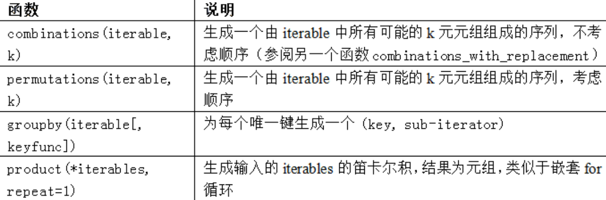


###  错误和异常处理

```python
# 为了处理异常, 我们常用 try   except 来进行
try:
  # 正常代码块
  
except:
  # 如果发生错误, 运行这里的代码
```


```python
# 对于某种特定的错误, 例如  ValueError , 可以这样
try:
  	# 正常的代码
except Value:
  	# 如果是Valueerror异常, 就执行这里的代码.
  
```


```python
# 如果遇到多个不同的错误,可以这样
try:
  	# 执行正常的代码
  
except (TypeError,ValueError):
  	# 如果发生生面两个错误 , 可以这样.
```


```python
# 假如, 无论程序是否异常, 都要执行某段代码, 是以使用finally
f = open(path,'w')
try:
write_to file(f)

except:
		print('Failed')
else:
		print('Succeeded')
finally:
	f.close()          # 无论程序是否别正确写入, 都会关闭文件
```


## 5. 文件和操作系统

> Python文件的默认操作是“文本模式”，也就是说，你需要处理Python的字符串（即Unicode）

### 文件读取

读取文件, 用到 `open()`'  和 `withopen` , 推荐使用 `withopen` , 如果用`open` , 在使用完文件后, 要记得关闭文件.


```python
lines = [x.rstrip() for x in open(path)]
# 这段代码中,  path 是文件路径. 


#这样拿到的内容 就是 向瞎买那这样的文本
'''   

['Sueña el rico en su riqueza,',
 'que más cuidados le ofrece;',
 '',
 'sueña el pobre que padece',
 'su miseria y su pobreza;',
 '',
 'sueña el que a medrar empieza,',
 'sueña el que afana y pretende,',
 'sueña el que agravia y ofende,',
 '',
 'y en el mundo, en conclusión,',
 'todos sueñan lo que son,',
 'aunque ninguno lo entiende.',
 '']
 


​```
```

如果想要一行一行挨个拿出来, 直接使用 `for`循环就行.


**对于读取文件时, 一些权限的介绍:**

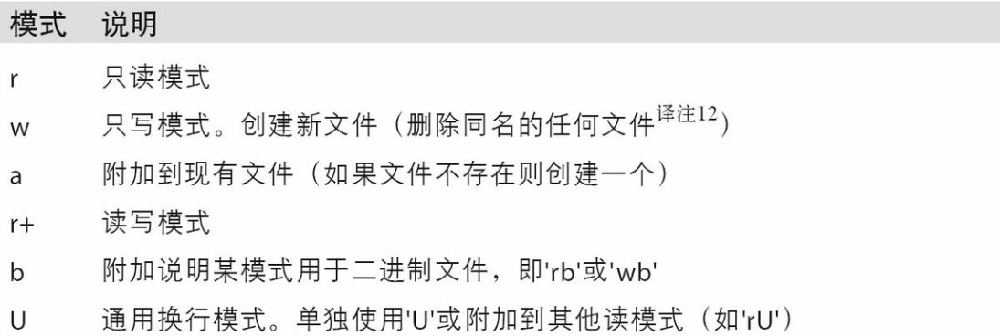


**对于可读文件的一些方法的介绍**

`read()` , 以字符串的形式返回文件数据, 读取文件的字符, 字符内容是由文件编码决定的.

```python
f = open(path)   # 此处的path是路径
f.read(10)
# 结果即使去取到了10个字符(按照自己的文件编码)
```


`tell`给出当前句柄的位置

```python
f.tell()

# 如果前面用read 读取了10个字符, 那么此时返回的就是11
```


`sys`模块的`getdefaultencoding()`方法可以帮助我们查看, 默认编码

```python
import sys
sys.getdefaultencoding()
```


`seek()`  将文件位置更改为文件中的指定字节

```python
f.seek(3)             
```

**注意:  不要在二进制模式中使用`seek`。如果文件位置位于定义Unicode字符的字节的中间位置，读取后面会产生错误`UnicodeDecodeError`**


`write` 或`writelines`方法, 将内容写入文件

```python
with open("path文件位置",'w') as handle:
  handle.writelines(x for x in open(path) if len(x) > 1)
```


`close()` , 如果使用 `open`来实现文件的操作, 那么最后一定要关闭文件

```python
f.close()
```


`decode()` , 当我们先将 读取到的某个二进制数据`data` 转换为 字符串的时候, 可以使用该方法, 来实现.

```python
data.decode('utf-8')    # 解码变为utf-8

# 其实在使用 with open 来读取文件的时候, 就可以使用encoding属性来解码.
```


`readlines`是将文件返回为列表, 和 `read`的用法差不多


`flush` 清空数据缓存, 并将数据强行写入磁盘.


#  5. 初识Numpy

## Numpy的ndarray 

1. NumPy最重要的一个特点就是其N维数组对象（即ndarray)

2. ndarray是一个通用的同构数据多维容器，也就是说，其中的所有元素必须是相同类型的。每个数组都有一个shape（一个表示各维度大小的元组）和一个dtype（一个用于说明数组数据类型的对象）

```python
import numpy as np

data = np.random.randn(2,3)

data  = data * 10
print ("乘以10", data,"\n" )

data = data +10
print("加10", data, "\n")

print(data.shape , "\n")

print(data.dtype)

```


## 创建数组

```python
# 用numpy创建数组

create_data1 = [6,7.5,8,0,1]
create_data2 = [[1,2,3,4],[5,6,7,8]]

arr1 = np.array(create_data1)  
print(arr1 , "\n")

arr2 = np.array(create_data2)
print(arr2)


# 查看数组的维度 
print(arr2.shape)      # 返回几行几列

print(arr2.ndim   )     # 返回2

```


`zeros`创建数组 

```python
# zeros 创建元素全为0的数组
print(np.zeros(10))

print(np.zeros((2,3)))

```


`empty` 创建数组, 但是不推荐

```python
# empty 也可以创建 看似为0 的数组, 到那时不推荐使用, 因为很多元素都没有初始化
np.empty((2,3))
```


`arrange` 创建数组

```python
# arange 方法可以生成元素连续的数组 ,  默认从0 开始
np.arange(10)
```


还有其他创建数组的方法:

| 函数              | 说明                                                         |
| ----------------- | ------------------------------------------------------------ |
| array             | 将输入数据（列表、元组、数组或其它序列类型）转换为ndarray。要么推断出dtype,要么特别指定dtype。默认直接复制输入数据 |
| asarray           | 将输入转换为ndarray,如果输入本身就是一个ndarray就不进行复制  |
| arange            | 类似于内置的range,但返回的是一个ndarray而不是列表            |
| ones,ones_like    | 根据指足的形状和dtype创建一个全1数组。one_like以另一个数组为参数，并根据其形状和dtype创建一个全1数组 |
| empty,empth_like  | 创建新数组, 但是值分配内存空间, 不填充值                     |
| full, full_like   | 用fill value中的所有值，根据指定的形状和dtype创建一个数组。full_like使用另一个数组，用相同的形状和dtype创建 |
| eye, identity     | 创建单位矩阵形式的方阵                                       |
| zeros, zeros_like | 创建元素全是 0 的数组                                        |
|                   |                                                              |


## ndarray 数据类型

### 数据类型介绍

数据类型可以通过如下类型进行转换:

```python
arry1 = np.array([1,2,3],dtype=np.float64)

```


**Numpy的数据类型有如下几种**

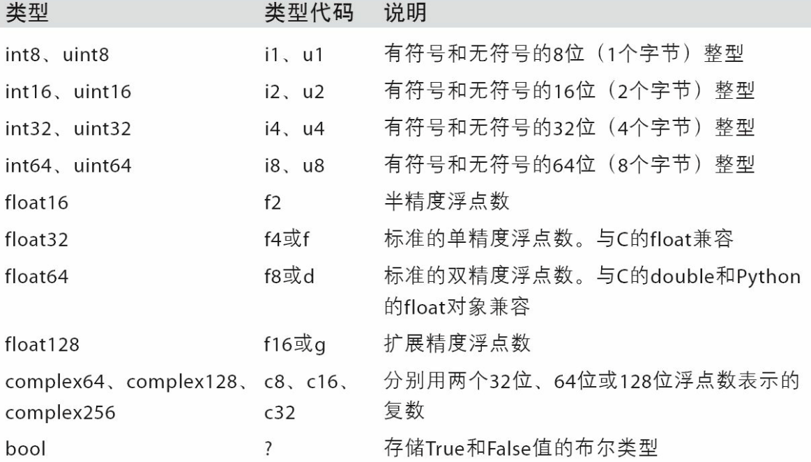


### 数据类型转换

1. **`astype `**可以实现数据类型的转换. 

```python
arr = np.array([1,2,3,4,5])
print(arr.dtype)

float_arr = arr.astype(p.float64)
print(float_arr)
```


2. **如果某字符串数组表示的全是数字，也可以用astype将其转换为数值形式**

```python
string_num = np.array(['1,','2','3'],dtype = np.string)
print(string_num.astype(float))
```

**注意:**

**使用numpy.string_类型时，一定要小心，因为NumPy的字符串数据是大小固定的，发生截取时，不会发出警告**


3. 如果人们比较懒，写的是float而不是np.float64；NumPy很聪明，它会将Python类型映射到等价的dtype上

```python
int_array = np.arrange(10)
caliber = np.array([.22,.267],dtype=np.float64)

print(int_array.astype(v))  # 这样就让 int_array 的数据类型转换为了 caliber 的数据类型
```


## 数组运算

```python
arr = np.array([1,2,3],[4,5,6])
arr2 = np.array([222,2,3],[4,5,6])

print(arr*arr)     # 对应元素相乘
print(arr - arr)     # 对应元素相减
print(1/arr)          # 每个元素都被 1 除
print(arr1 > arr2)   # 对应元素返回 bool 值 , 也就是True 或者 False

```


## 基本的索引和切片


### 一维数组

```python
arr = np.arange(10)

arr_slice = arr[5:8]
arr_slice[:] = 111
arr_slice[1:2] = 12      #此时arr数组中对应的值也发生了变化.


# 如果想要使用的是一个全新的数组, 而不是视图, 可以如下:
arr_slice = arr[5:8].copy()
```


### 二维数组

二维数组, 使用的是索引值来找到元素.

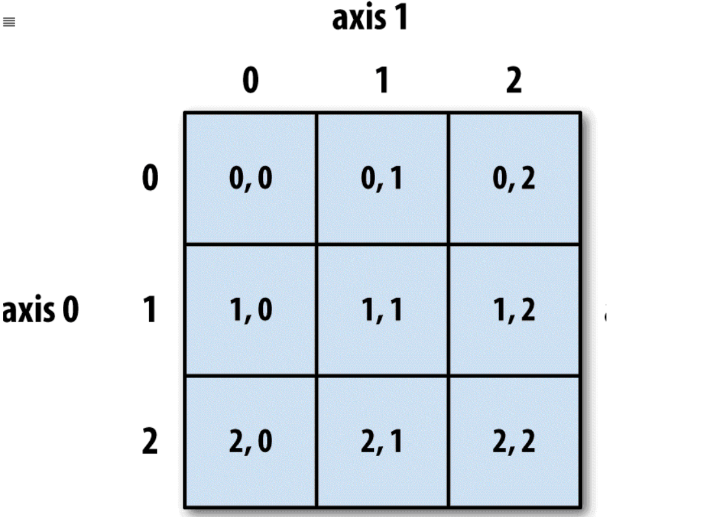


```python
arr2d = np.arrange([1,2,3],[1,2,3])
arr2d[1]      # 拿出索引为1 的行的所有的元素
arr2d[1][1]   #也可以写成 arr2d[1,1] 
              # 拿到行的索引为 1, 列的索引也为1的元素.
```


### 多维数组

仍然是通过索引值来拿到.

```python
arr3d = np.array([[[1, 2, 3], [4, 5, 6]], [[7, 8, 9], [10, 11, 12]]])

arr3d[0,1,2,3]     #索引值为 第一维是 1, 第二维是 2, 第三维是 3的元素
arr3d[0]           # 拿出第一位的所有元素
arr2d[:, :1]       # 表示拿到所有行的第0列
```


## 布尔型索引

```python
names = np.array(['Bob', 'Joe', 'Will', 'Bob', 'Will', 'Joe', 'Joe'])
data = np.random.randn(7,4)

names == 'Bob'   ##返回 bool值列表
data[names == 'Bob'  ]   #返回True对应的行, 
											#比如 第一个是True, 那么第一行就被拿出来了.

data[nmaes='Bob',2]     # 拿到对应行的前两列

names = != 'Bob'        # 拿到bool值 , 还可以写成如下形式
data[~(names== 'Bob')]   #  ~ 拿到反转条件, 很好用.


```

**注意:**

**布尔型数组的长度必须跟被索引的轴长度一致, 否则报错**


> 要进行联合查询, 要是用 `&`表示 `和` , 以及 `|` 表示 `或`
>
> 不能使用`and , or`

```python
mask = (names=='Bob') | (names == 'Will')
print(data(mask))
```


```python
# 将data中所有的复数均设为 0
data[data<0] = 0
```


## 花式索引

1. 如果 arr 是一个 二维数组, 那么我们可以这样**取出某些行**.

```python
arr[[4,3,0,6]]
```

这样就取出了第 4 行, 第3行, 第0行, 第6行

**如果使用的是负数, 那么就倒着取, 也就是从最后一行开始**


2. **取出指定的元素**, 可以这样:

   ```python
   arry = np.arange(32).reshape((8,4))  # 构造 8 行 4列的元组
    arr[[1, 5, 7, 2], [0, 3, 1, 2]]
     
     # 取出(1,0)   (5,3)  (7,1)  (2,2)  这些元素
     # 需要注意的是结果是一个一维的列表
   ```

   

3. **选取某片区域**

   ```python
   arr[[1,5,7,2][[: , [0,3,1,2]] 
   # 选取 第 1 行, 第0 , 3, 1,2 列的数据
   # 选取第 5行, 第0 , 3, 1,2 列的数据
   # 选取....
   ```

**花式索引跟切片不一样，花式索引总是将数据复制到新数组中**


## 数组转置和轴对换

1. 假如有一个数组 `arry` , 那么在`Numpy` 中, 要想得到它的转置, 可以直接这样 `arry.T`, 它返回的是源数据的视图（不会进行任何复制操作）.

2. `swapaxes`也是返回源数据的视图（不会进行任何复制操作）。

   例如:`arr.swapaxes(1, 2)` 是一个 NumPy 数组的方法，用于交换数组的两个指定轴。

   在给定的代码中，`arr.swapaxes(1, 2)` 将数组 `arr` 的第一个轴（索引为 1）和第二个轴（索引为 2）进行交换。

   ```python
   In [135]: arr
   Out[135]: 
   array([[[ 0,  1,  2,  3],
           [ 4,  5,  6,  7]],
          [[ 8,  9, 10, 11],
           [12, 13, 14, 15]]])
   In [136]: arr.swapaxes(1, 2)
   Out[136]: 
   array([[[ 0,  4],
           [ 1,  5],
           [ 2,  6],
           [ 3,  7]],
          [[ 8, 12],
           [ 9, 13],
           [10, 14],
           [11, 15]]])
   ```

   

3. `transpose` 可以实现对轴的交换.

   ```python
   In [132]: arr = np.arange(16).reshape((2, 2, 4))
   In [133]: arr
   Out[133]: 
   array([[[ 0,  1,  2,  3],
           [ 4,  5,  6,  7]],
          [[ 8,  9, 10, 11],
           [12, 13, 14, 15]]])
   In [134]: arr.transpose((1, 0, 2))
   Out[134]: 
   array([[[ 0,  1,  2,  3],
           [ 8,  9, 10, 11]],
          [[ 4,  5,  6,  7],
           [12, 13, 14, 15]]])
   ```

   **第一个轴被换成了第二个，第二个轴被换成了第一个，最后一个轴不变**


2. 计算矩阵的内积, 可以用 `np.dot` .  例如:

   ```python
   np.dot(arr.T , arr)
   ```

   


## 通用函数

下面介绍一下一些通用函数

```python
sqrt		# 计算平方根的 , 例如 np.sqrt(arr2)

maximum  # 比较两个数组对应元素的大小, 做成新的数组, 例如:
					np.maximum(arr1, arr2)
  
modf    # 返回两个数组, 一个是原数组元素的小数部分, 一个是整数部分

			 # remainder, whole_part = np.modf(arr)

abs , fabs          # 计算整数、浮点数或复数的绝对值。对于非复数值，可以使用更快的fabs

square   # 计算各元素的平方

exp      # 计算各元素指数

log,log10,log2,log1      # 分别计算 自然底数e, 底数为0 , 底数为2 , 以及log(1+x)

sign      # 计算各元素的正负号

ceil      # 向上取整, 计算各元素大于等于改制的最小整数

floor     # 向下取整, 计算各元素小于等于该值的最大整数

rint      # 四舍五入取整

isnan  	  # 返回一个表示“哪些值是NaN(这不是一个数字)”的布尔型数组

isfinite , isinf   # 分别返回一个表示“哪些元素是有穷的（非inf,非 NaN)”或“哪些元素是无穷的”的布尔型数组

cos , sin , tan, cosh, sinh , tanh   # 普通三角函数 和双曲三角函数

arccos , arccosh, arcsin, arcsinh,arctan,arctanh   # 反三角函数

logical_not       # 返回各元素not x 的真值, 相当于 -arr


# ====下面的函数, 需要接受两个数组, 其返回结果一个数组=======
add		   # 将数组中对应的元素相加

subtract  # 从第一个数组中减去第二个数组的元素

multiply	# 数组元素相乘

divide    # 除法

floor_divide  # 向下圆整除法(丢弃余数)

power     # 对第一个数组中的元素A,根据第二个数组中的相应元素B,计算A的B次方

minimum   # 元素级最小值计算

mod			 # 元素级的求模(除法的余数)

copysign  #将第二个数组中的值的符号复制给第一个数组中的值


greater, greater_equal ,less, less_equal , equal , not_equal  # 执行元素级的比较运算，最终产生布尔型数组。相当于中缀运
 																											 # > , >= < , <= , == ,!=


logical_and , logical_or, logical_xor    # & , |  , ^

```


## 利用数组进行数据处理

1. `np.meshgrid(x,y)` 接受两个一维数组，并产生两个二维矩阵（对应于两个数组中所有的(x,y)对） , 对 x, y 进行这样的转化后, 再去计算一些公式, 这样可以提高计算速度

2. `np.where`  , 相当于` x if condition else y`,例如:

   ```python
   np.where(arr>0 , 2, arr) # 将arr中的正值变为2 , 其他不变
   ```

   

3. `mean` 和 `sum` ,分别计算平均值 和 求和

   ```python
   arr.mean()    #  arr.mean(axis=1) , 表示计算行的平均值
   
   arr.sum()      # arr.sum(axis = 0), 表示计算列的和
   
   ```

   

4. `cumsum` 计算累加 , 同样也可以通过 `axis=0`,或者 `axis=1`计算行和列的累加


5. `cumprod`计算累乘 


6. `std`  计算标准差

7. `var` 计算方差

8. `argmin`, `argmax` 分别为最大和最小元素的索引

9. `any` 和 `all` , any用于测试数组中是否存在一个或多个True，而all则检查数组中所有值是否都是True

10. `sort` 可以进行排序, 这种排序则会修改数组本身 , 例如:

    ```python
    arr.sort(1)                   # 按照行从左到右进行由低到高排序
    ```

    

11. `np.unique` 找出数组中的唯一值并返回已排序的结果 , 就是得到去重结果

12. `np.in1d` 测试一个数组中的元素是否在另一个数组中, 例如:

    ```python
    In [211]: values = np.array([6, 0, 0, 3, 2, 5, 6])
    In [212]: np.in1d(values, [2, 3, 6])
    Out[212]: array([ True, False, False,  True,  True, False,  True], dtype=bool)
    ```

    


13. `intersect1d(x,y)`计算 x 和 y中的公共元素 , 返回有序结果
14. `union1d(x,y)` 计算x 和 y 的并集, 返回有序结果
15. `in1d(x,y)`   得到一个表示“×的元素是否包含于y”的布尔型数组
16. `setdiff1d(x,y) ` 得到集合的差，即元素在x中且不在y中
17. `setxor1d(x,y)`  集合的对称差，即存在于一个数组中但不同时存在于两个数组中的元素译注2


## 数组的二进制文件输入输出

`np.load('***.npy')` 读取文件

`np.load('**.npz')` 读取类似于字典的对象, 可以通过`key` , 拿出`value`.

`np.save('***' , arr)` 保存数据`arr`

`np.savez(***,arr1 , arr2, arrn)` 将多个数组保存

`np.savez_compressed('**.npz', arr1,arr2)` 将数据压缩保存


## 线性代数

`np.dot(x,y)` 进行矩阵的乘法

`@`符号, 也可以用作矩阵乘法, 如 `x@y`

`arr.T` 得到转置

`diag` 以一维数组的形式返回方阵的对角线（或非对角线）元素，或将一维数组转换为方阵（非对角线元素为0)

`trace`  计算对角线的和

`det`   计算矩阵行列式

`eig`  就散方阵的本征值和本征向量

`inv` 计算方阵的逆

`pinv` 计算矩阵的`Moore-Penrose`伪逆

`qr` 计算`QR`分解

`svd`  计算奇异值分解

`solve`  解线性方程组`Ax = b` , 其中A为方阵

`lstsq`  计算Ax =b 的最小二乘解


## 伪随机数生成

> 这里主要对 `np.random` 函数的搭配进行简单介绍.

`np.random.normal(2,2)` 生成 2 * 2的标准正态分布

`np.random.seed(数字)` 更改随机数生成种子, 这个是全局的

`numpy.random.RandomState`生成与其它隔离的随机数生成器.

`permutation`  返回一个序列的随机排列或返回一个随机排列的范围

`shuffle` 对一个序列就地随机排序

`rand`  产生均匀分布的赝本

`randint` 从给定的上下限范围内随机选取整数

`randn `  产生正态分布的样本, (平均值为0 , 标准差为1)

`binomial`  产生二项分布的样本值

`beta`    产生 Beta分布的样本值

`chisquare`  产生卡方分布的样本值

`gamma`       产生Gamma 分布的样本值

`uniform`   产生(0,1) 均匀分布的样本值


# 6. 初识Pandas

> pandas的两种主要数据结构分别是 `Series` 和 `DataFrame`

## Series

1. `Series`由一组数据（各种NumPy数据类型）以及一组与之相关的数据标签（即索引）组成 ,  索引在左, 值在右边

```python
obj = pd.Series([4,7,-5,3])   #生成最简单的Series

obj.values      # 拿出值
obj.index       # 拿出索引
```


2. `index`  除了默认的, 也可以认为设定

```python
obi2 = pd.Series([4,7,-5,3], index = ['d','b',a','c'])
```


3. 可以通过` index`拿到单个或者一组值

   ```python
   obj2['a']    # 拿到索引 a 对应的值
   
   obj2['c','a','b']    # 拿到一组值
   ```

   


4. 使用NumPy函数或类似NumPy的运算（如根据布尔型数组进行过滤、标量乘法、应用数学函数等）都会保留索引值的链接


5. 可以将Series看成是一个定长的有序字典，因为它是索引值到数据值的一个映射


6. ```python
   # 可以将字典之间转化为 Series
   pd.Series(my_dict)               # 此时的索引值就是字典的key
   
   ```


7. 如果只传入一个字典，则结果Series中的索引就是原字典的键（有序排列）。你可以传入排好序的字典的键以改变顺序

   ```python
   nex_index = ['Califronia', 'dddd' 'Ohio']
   obj4 = pad.Series(dict, index = new_index)
   ```

   **注意:  如果没有找到索引对应的值, 对应的返回结果就是 NaN  , 而 missing 或者 NaN 在Pandas中表示缺失值**


8. 使用 `isnull` 或者 `notnull` 检查数据是否缺失

   `pd.isnull()` 或者 `pd.notnull()`


## DataFrame

## pandas 的数据结构介绍

DataFrame既有行索引也有列索引，它可以被看做由Series组成的字典(共用同一个索引).

**DataFrame的构建如下:**

```python
data = {'state': ['Ohio', 'Ohio', 'Ohio', 'Nevada', 'Nevada', 'Nevada'],
        'year': [2000, 2001, 2002, 2001, 2002, 2003],
        'pop': [1.5, 1.7, 3.6, 2.4, 2.9, 3.2]}
frame = pd.DataFrame(data)
```

**DataFrame** 的存入的数据形式就是 上方的 `data`的形式.

有点像字典, 但是它不是字典.

**结果**:

```python
In [45]: frame
Out[45]: 
   pop   state  year
0  1.5    Ohio  2000
1  1.7    Ohio  2001
2  3.6    Ohio  2002
3  2.4  Nevada  2001
4  2.9  Nevada  2002
5  3.2  Nevada  2003
```


1. **对于特别大的DataFrame，head方法会选取前五行**

2. 如果指定了列序列，则DataFrame的列就会按照指定顺序进行排列. `columns`代表的事**每列的标题**, 而`index` 代表的事**每行的标题**

   ```python
   frame2 = pd.DataFrame(data,columns = ['year','state','pop'])
   ```

   这样的结果就是第一, 二 , 三列分别是 `year`, `state`, `pop`

3. 如果传入的列在数据中找不到，就会在结果中产生缺失值
4. 如果想要取出某一列, 可以用 `frame2["state"]` 或者 `frame2.state` , 取出的格式就是一个Series

5. 如果想要取出某一行, 可以用 `frame2.loc["index的值"]`  , 这样既可以取出对应index的那行内容

6. 将列表或数组赋值给某个列时，其长度必须跟DataFrame的长度相匹配。如果赋值的是一个Series，就会精确匹配DataFrame的索引，所有的空位都将被填上缺失值

   ```python
   pd.Series([-1,-1.5,-1.7],index = ['two','four','five'])
   ```

   那些没有指定 `index`的值都将是 `NaN`

7. 为不存在的列赋值会创建出一个新列。关键字del用于删除列

   ```python
   # 例如 , 删除 eastern 这一列
   del frame2['eastern']
   
   
   # 查看所有的列
   frame2.columns 
   ```


8. 如果嵌套字典传给DataFrame，pandas就会被解释为：外层字典的键作为列，内层键则作为行索引

   ```python
   pop = {'Nevada': {2001: 2.4, 2002: 2.9},
           'Ohio': {2000: 1.5, 2001: 1.7, 2002: 3.6}}
     
     
   frame3 = pd.DataFrame(pop)
   
   # 如果打印出来, 会是下面这种情况
         Nevada  Ohio
   2000     NaN   1.5
   2001     2.4   1.7
   2002     2.9   3.6
   
   ```

   

9. DataFrame的转置

   ```
   frame2.T
   ```


10. 指定 `index` , 进行每列数据的排序

    ```python
    pd.DataFrame(pop, index = [2001,2002,2003])
    ```


11. 还可以如下进行切割

    ```python
    pdata = {'Ohio': frame3['Ohio'][:-1],
          'Nevada': frame3['Nevada'][:2]}
    
    pd.DataFrame(pdata)
    ```


12. **可以输入给DataFrame的构造数据**

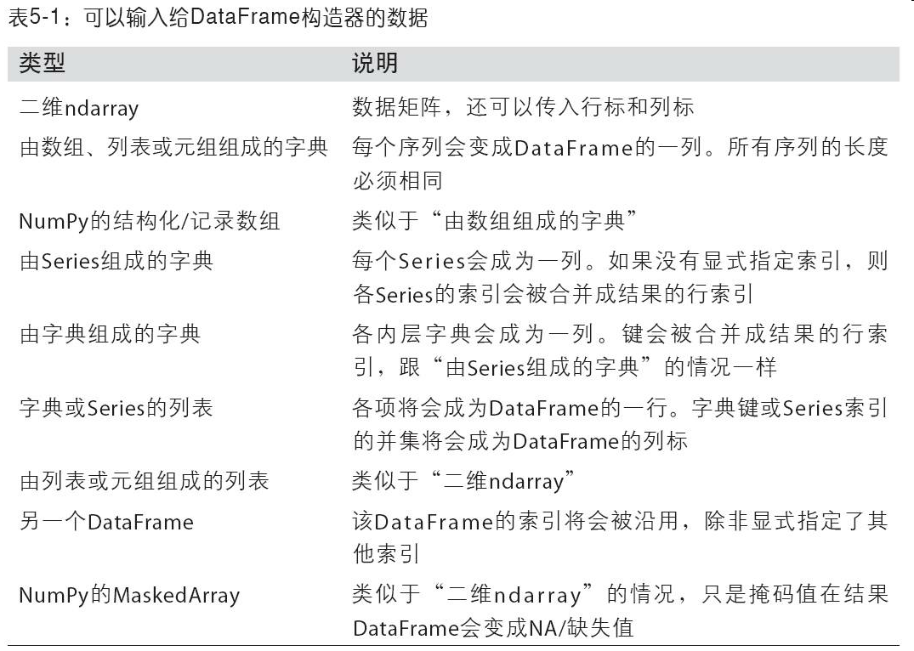


13. 通过指定`index` 和`columns` 的`name` 属性, 可以查看指定信息

    ```python
    frame3.index.name = 'year' ; frame3.columns.name = 'state'
    ```

    

14. 通过 `values` 也可以返回信息

    ```python
    frame2.vlues
    ```

    

15. 构建Series或DataFrame时，所用到的任何数组或其他序列的标签都会被转换成一个`index` . `index` 是不可变的用户不能对其进行修改 , 但是可以调整每个原有`index` 的顺序.

16. 判断`index` 或者 `columns`是否存在

    ```python
    'columns的名字' in frame2.columns   # 返回布尔值
    
    'index的名字' in frame2.columns # 返回布尔值
    ```


17. pandas的Index可以包含重复的标签.

    ```python
    dup_labels = pd.index(['ff','ff', 'bar','bar'])
    ```

    选择重复的标签，会显示所有的结果

一些关于`index`属性和方法介绍:

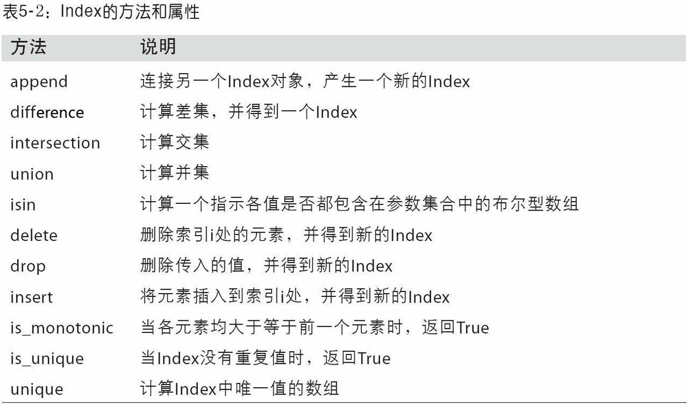


## pandas 的基本功能

1. `reindex` 可以实现创建新的对象, 它的数据符合新的索引.

```python
obj1. = pd.Series([1,2,3.3,4],index=['d','b','a'])

obj2 = obj1.reindex(['a','b','c'])
```


也可以通过`reindex`对 `index` 和 `columns`进行索引.

```python
states = ['Texas','Utah']
frame.reindex(columns = states)
```


`reindex`的一些参数介绍:

| 参数       | 说明                                                         |
| ---------- | ------------------------------------------------------------ |
| index      | 用作索引的新序列。既可以是Index实例，也可以是其他序列型的Python数据结构。Index会被完全使用，就像没有任何复制一样 |
| method     | 插值（填充）方式                                             |
| fill_value | 在重新索引的过程中，需要引入缺失值时使用的替代值             |
| limit      | 前向或后向填充时的最大填充量                                 |
| tolerance  | 向前后向后填充时，填充不准确匹配项的最大间距（绝对值距离）   |
| level      | 在Multilndex的指定级别上匹配简单索引，否则选取其子集         |
| copy       | 默认为True,无论如何都复制；如果为False,则新旧相等就不复制    |


2. 使用`ffill`可以向前添值

   ```python
   pd.Series(['blue','purple','yellow'] , index = [0, 2, 4])
   obj3.reindex(rang(6), method = 'ffill')
   ```

   

3. 按照指定的`index` 和 `columns` 进行创建

   ```python
   frame = pd.DataFrame(np.arrange(9).reshape(3,3),
                       index = ['a','c','d'],
                       columns = ['Ohio','Texas','California'])
   ```

   


### 丢弃指定轴上的项

```python
obj = pd.Series(np.arange(5.),index=['a','b','c'])
new_obj = obj.drop('c')   # 删除 c 索引所在的项
new_obj = obj.drop(['a', 'b'])  # 删除 a, b 所在的索引项
```


```python
# DataFrame的数据格式的 也可以通过索引删除
data = pd.DataFrame(np.arange(16).reshape((4,4)),
                   index = ['Ohio','Utah', 'NewYork','Colo'],
                   columns = ['one','two','three','four'])

data.drop(['Ohio','Colo'])
```


```python
#删除列的值
data.drop(['two','three'], axis = 'columns')  # 也可以用 axis = 1
```


```python
# 销毁所有被删除的数据用 inplace
obj.drop('c',inpace = True)             # 确认销毁c 索引所对应的值.
```

**小心使用inplace，因为它会销毁所有被删除的数据**


### 索引、选取和过滤

```python
 data[:2]  # 切片
  
  data[data['three'] > 5]   # 如果data是二维数组, 拿出的是 column 为 three的值大于5 的一个二维数组
  data < 5                 # 得到的就是一个 bool 值的 数组
  
  data[data < 5] = 0        # 对符合指定条件的数组进行赋值
```

**非常推荐使用`loc` 和 `iloc` 进行索引**.

```python
# 通过 loc 和 iloc 来获取     指定行  和 指定列的数据
data.loc['某个index',['某个列', '某个列'] ]
data.loc[:'列名', '行名index']    # 切片


data.iloc[1,[1,3,2]]  # iloc和loc一样, 但是 iloc用的是用数字表示第几行, 第几列
data.iloc[数字]  # 如果只填一个值, 那么选取的就是 某一行的数据
data.iloc[: ,:3][data.three > 5]  # 多个条件进行筛选 , 这里的three可以换成data中有的索引的名字.


```

**一些方法的汇总:**

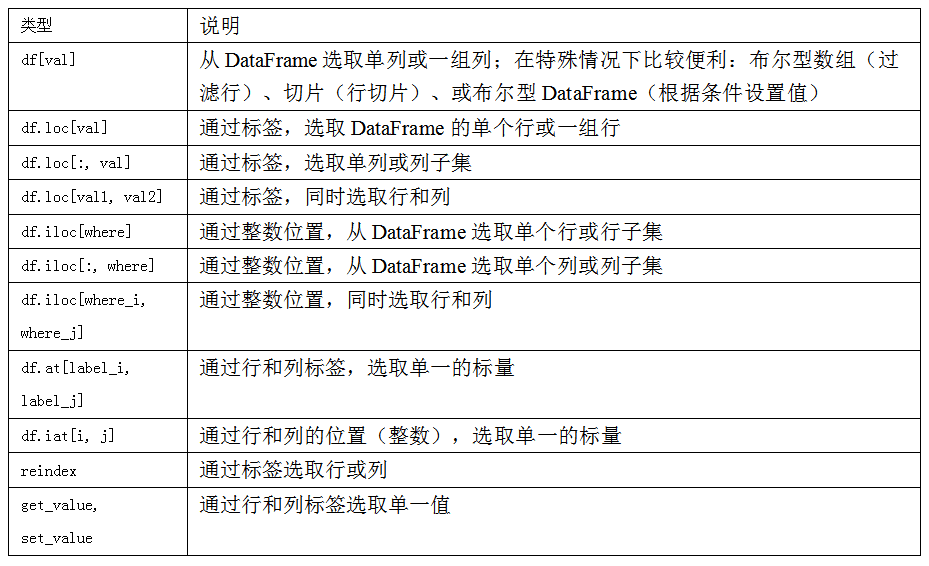


### 算数方法运算

1. 如果两个 DataFrame进行进行相加, 那么只有 `行`和`列`相同的情况下的值才会相加, 如果有一个不同, 那么返回的就是`NaN`

2. Series 数据也是只有在对应的 `行`的名字相同的情况下, 才会进行正常的运算, 否则得到的结果是 `NaN`

3. ` df1.add(df2, fill_value=0)` 将 ` df1` 和 `df2`相加, 并且缺失值用 `0`来填充

4. `1 / df1` 等价与 `df1.rdiv(1)` , 类似的一些运算如下表所示:

   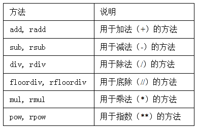

5. `frame-frame.iloc[0]` 这样就是`frame`第一行减去了第一行.

6. 如果想要DataFrame数据的每一行减去某一个Series, 可以这样:

   ```python
   frame.sub(series3,axis = 'index')  
   # 这样frame的每一行的每一个元素都会减去series对应行的值
   ```


### 函数应用和映射

1. 取绝对值用 `np.abs()`

   ```python
   np.abs(frame2)  # 将每一个元素都取绝对值
   ```

   

2. 将函数应用到各行, 或者各列所在的一维数组上, 用`apply`

   ```python
   f = lambda x: x.max() - x.min()
   frame2.apply(f)         # 默认会作用在每列上
   
   frame2.apply(f, axis = 'columns') # 这样指定了 cloumns , 就可以作用在行上了.
   ```

   

3. 对数组进行**格式化**

   ```python
   format = lambda x: '%.2f' % x
   frame2.applymap(format)
   
   # 如果是Series数据, 可以使用map方法
   frame['a'].map(format)
   ```

   

4. **排序**

   **使用`sort_index`进行排序**

   ```python
   obj = pd.Series(rang(4), index[['d','a','b','c']])
   
   # 按照 index 和  columns 进行排序
   # 对于Series格式的, 可以使用 sort_index 进行排序
   obj.sort_index()
   
   # 对于 DataFrame格式来说,  还可以通过 指定行列进行排序
   frame2.sort_index(axis = 1)
   
   
   
   # 按照值进行排序
   obj.sort_values()
   # 注意:  在排序时，任何缺失值默认都会被放到Series的末尾
   
   frame2.sort_values(by='b')  # 按照b这列的值进行排序
   frame2.sort_values(b=['a','b'])  # 按照 a 和 b 列进行排序
   
   
   
   # 升降序
   # 排序默认是按照升序, 但是可以用 ascending  来指定降序
   frame.sort_index(axis = 1, ascending = False)
   ```

   

   **使用` rank`进行排序**

   ```python
   # rank是通过“为各组分配一个平均排名”的方式破坏平级关系的
   obj.rank()
   
   # 根据值在原数据中出现的顺序给出排名
   obj.rank(method='first')
   
   # 在裂伤进行排名
   frame.rank(axis = 'columns')
   
   # 按照降序进行排序
   obj.rank(ascending = False , method= 'max')
   ```


​	**一些属性的介绍:**

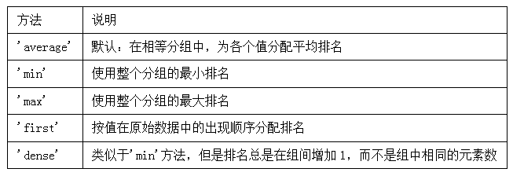


**注意**:

1. 虽然许多pandas函数（如reindex）都要求标签唯一，但这并不是强制性的

2. is_unique属性可以告诉你它的值是否是唯一

3. 对于带有重复值的索引，数据选取的行为将会有些不同。如果某个索引对应多个值，则返回一个Series；而对应单个值的，则返回一个标量值

   ```python
   obj['a'] 
   frame2.loc['b']
   ```


## 汇总和计算描述统计

1. 调用DataFrame的`sum`方法将会返回一个含**有列的和**的Series

   ```python
   frame2.sum()
   ```

   **如果想要对行进行操作, 可以如下操作:**

   ```python
   frame2.sum(axis=1)
   ```


2. 如果含有`NA` 值, 它将会被自动排除, 对那些能计算的部分进行计算. 

   而如果想要实现只要出现`NA`值的, 最终结果都算作 `NA` , 可以这样:

   ```python
   frame2.mean(axis = 'columns', skipna= False)
   ```

   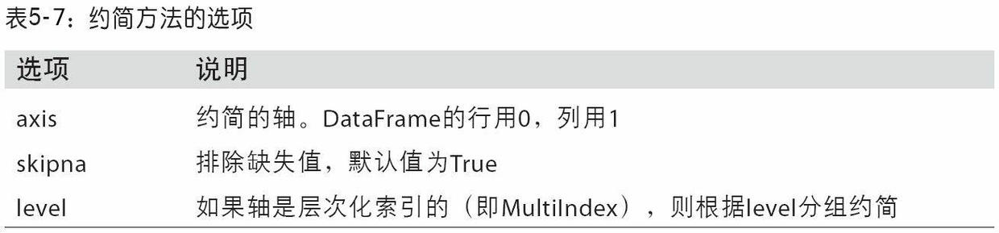


3. ```python
   frame2.idxmin()  # 获得最小值所在的行 和 列 
   frame2.idxmax()  # 获得最大值所在的行 和 列
   
   frame2.cumsum()  # 获得列的累加
   
   frame2.descrive()  # 一次性获得多个结果, 包括, mean, std, min , max等
   
   
   ```


**汇总和计算描述统计**

​	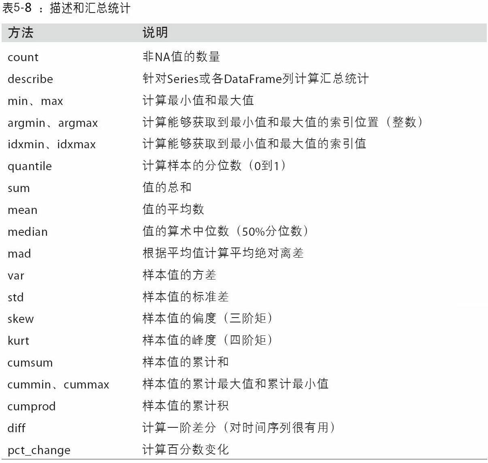


## 相关系数与协方差

1. 用`cov` 计算协方差
2. `corr` 计算相关系数
3. 使用`corrwith` 可以计算两个不同的Dataframe 或者 Series 的相关系数.


## 唯一值、值计数以及成员资格


```python
obj_series.unique()       # 得到唯一值

obj_seies.value_counts()     # 得到各值出现的频率  


obj.isin(['a','b'])            # 看 a , b 是否在obj中, 返回的事布尔值

pd.Index(obj2).get_indexer(obj3)   # 返回obj2 中每个元素的值, 在 obj3中的索引


```

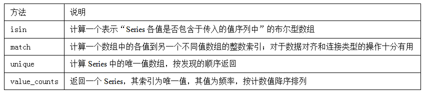


# 数据的读取和写入

> 下面是pandas中的, 一些读取文件的函数: 

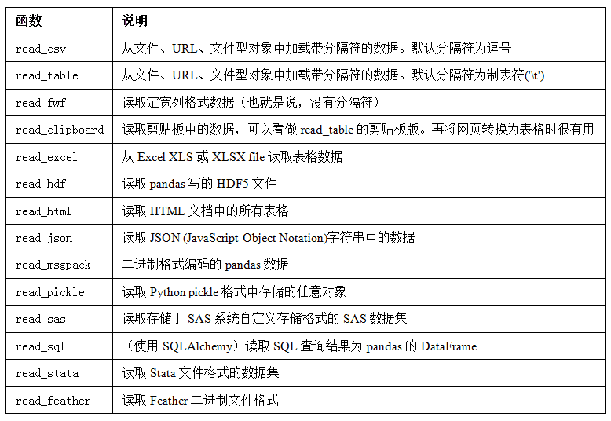


**`read_csv`文件**

```python
df = pd.read_csv('cs文件所在的路径.csv')            

df = pd.read_csv('cs文件所在的路径.csv' , sep = ',')  # 指定分隔符, 用逗号分隔

df = pd.read_csv('cs文件所在的路径.csv' , header = None)   # 指定无标题

df = pd.read_csv('cs文件所在的路径.csv', names = ['a','b','c'])   # 设置标题名字

df = pd.read_csv('cs文件所在的路径.csv',names = ['a','b','c'], index_col = ['c','d'])  # 指定第c, d 列的值作为各行的index


```


**`read_table`文件(txt)**

```python
result = pd.read_table('txt文件的路径', sep='这规则表达式')
```


