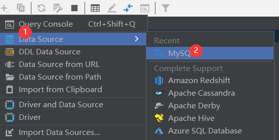

> # 注意
>
> 1. `write`只能写入字符串, 而爬虫一般拿到的是 `json`等格式的数据, 所以就需要将其转换为python的数据类型.


# requests 模块

## 常用请求的介绍

```python
response.encoding = 'utf-8'    # 防止乱码
print(response.encoding)       # 这个编码格式是自己发起请求的编码格式, 比如我用的是pycharm,                            #那么请求的编码格式就是 pycharm 的编码格式, 而不是返回网页的编码格式.
print(response)                # <Response [200]>
print(response.status_code)    # 200
print(response.content)        # 适用于获取图片, 音频, 视频
print(response.headers['content-type'])  # 打印返回内容的 类型
print(response.request.headers)  # 获取请求头的信息  {'User-Agent': 'python-requests/2.24.0', 'Accept-Encoding': 'gzip, deflate', 'Accept': '*/*', 'Connection': 'keep-alive'}
print(response.headers)           # {'Connection': 'close', 'Content-Length': '0'}         

```


## 注意

> # Get 请求下
>
> 1. 在进行数据抓取的时候, 一定要先确定, 我们的数据在将要抓取的网页的源代码里面.
>
>    **方法:**
>
>    1. 直接在看到的网页中复制某段文字
>    2. 鼠标右键,   **检查元代码**
>    3. Ctrl + F  查询内容
>
>    如果在源代码里面那就可以直接进行获取工作了
>
>    
>
> 2. 如果直接在**看到的网页对应的源代码**中没有找到我们想要的内容, 那么我们可以直接通过 **检查网页**中的
>
>    **Network** 去寻找数据在哪里. (原因: Get数据肯定已经被加载了, 只是暂时没看到)
>
>    小技巧:  最好点 **Fetch **, 如果用**All** ,面对所有的数据包, 不好找.
>
> 3. 
>
>    这里就是 浏览器的搜索栏 **域名?**  后面的参数了
>
> 4. 不同数据包的都不同,比如第一页对应一个数据包, 第二页对应第二个数据包, 他们的不同点就在于  **检查网络** 的 **Network** 中的 **Payload**


## 实例

### 实例一: 拿到百度网页的log

```python
import requests

# 爬取图片 , 爬取百度图片的小例子.
def get_image(url):
    resp = requests.get(url)
    image_data = resp.content
    with open("Store_Spier_Image/image.png",'wb') as image_file:
        image_file.write(image_data)

if __name__ == "__main__":
    # 图片地址  www.baidu.com/img/PCtm_d9c8750bed0b3c7d089fa7d55720d6cf.png
    image_url = "http://www.baidu.com/img/PCtm_d9c8750bed0b3c7d089fa7d55720d6cf.png"
    get_image(image_url)

```


### 实例二: 携带`headers ` 和` params `查询权重

> **针对于那种不需要登录账号的网站, 都是公共数据, 都是可以爬取的**
>
> 如果需要登录账号, 请谨慎, 请谨慎, 请谨慎.

**携带headers, 获取查权重网页内容**

```python	
import requests
def get_ai_weight(prepared_domain):
    # 我们想要拿到参数爱站词云, 可以这样
    Init_CheckICPWebSite_Url = "https://www.aizhan.com/cha/{}".format(prepared_domain)
    headers = {"user-agent": "Mozilla/5.0 (Windows NT 10.0; Win64; x64) AppleWebKit/537.36 (KHTML, like Gecko) Chrome/105.0.0.0 Safari/537.36"}
    print(Init_CheckICPWebSite_Url)
    resp = requests.get(Init_CheckICPWebSite_Url,headers=headers)   # 不加 headers , 就不会被显示出来.
    print(resp.text)

if __name__ == "__main__":
    prepared_domain = "www.baidu.com"
    get_ai_weight(prepared_domain)
```


**带着 `headers `和 ` param`权重**

`注意此处只是个示范, 并不一定成功, 因为用不到 param, 只是为了学习而已`

**一定要注意 `param`只是针对get请求的, 不适用与post请求**

```python

    # 注释部分对应与Get的传参
    # Init_CheckICPWebSite_Url = "https://www.aizhan.com/cha"
    # params = {"key":"value"}   # 这种方式凭借的路径就是 https://www.aizhan.com/cha?key=value
    # headers= {"user-agent": "Mozilla/5.0 (Windows NT 10.0; Win64; x64) AppleWebKit/537.36 (KHTML, like Gecko) Chrome/105.0.0.0 Safari/537.36"}
    # resp = requests.get(Init_CheckICPWebSite_Url,params, headers = headers)
    #print(resp.text)
```


`urlencode`  和`param` 权重

```python
# 和上方代码差不多, 这里主要为了介绍 urlencode 用法 , 拼接  url 和 param
# urlencod 会自动 将 param 也就是 key= value , 与 Init_CheckICPWebSite_Url 拼接, 形成新的Init_CheckICPWebSite_Url

from urllib.parse import urlencode  # 直接将鼠标放在urlencode后面, 然后 Alt+Enter 就会出现导入选项了.
Init_CheckICPWebSite_Url = Init_CheckICPWebSite_Url +  urlencode(param)
```


### 实例三: `proxies`配置代理ip 并 打印当前ip

可以使用一些免费的代理ip , 防止自己真实的ip被封禁. 下面介绍一下 `proxies` 参数 , 并打印自己的参数

```
import requests

# 配置代理
def set_ip():
    url = "http://httpbin.org/ip"
    proxies = {"http":"http://47.106.105.236:80"}  # 这个代理ip不能用了, 只是为了示范
    resp = requests.get(url,proxies=proxies)
    print(resp.text)


if __name__ == "__main__":
    prepared_domain = "www.baidu.com"
    # get_ai_weight(prepared_domain)
    set_ip()

```


### 实例四: 输入人名, 获取百度贴吧内容

```
# This file used to get data of baidu_tiebar
import time
import requests

class Spider_tiebar:
    # 初始化参数, 需要传入 name
    def __init__(self,name):
        self.name = name
        self.url =  "https://tieba.baidu.com/f?kw=" + self.name + " &ie=utf-8&pn={}"
        self.headers = {
            "user-agent": "Mozilla/5.0 (Windows NT 10.0; Win64; x64) AppleWebKit/537.36 (KHTML, like Gecko) Chrome/105.0.0.0 Safari/537.36"
        }

    # 获取所有页面的连接, 存放在列表中
    def get_url(self):
        url_list = []
        for i in range(5) :       #拿出 0 到 4
            url_list.append(self.url.format(i*50))
        return url_list

    # 获得源码
    def parse_page(self,tb_url):
        time.sleep(3)
        resp  = requests.get(tb_url,headers=self.headers)
        resp.encoding='utf-8'
        return resp.text

    # 写入数据
    def write_data(self,page_number,tb_html):
        file_path = "{}__第{}页.html".format(self.name,page_number)
        with   open("./"+file_path,'w',encoding='utf-8') as f1 :
            f1.write(tb_html)


    def run(self):
        bar_Url = self.get_url()         # 在类中调用函数用 self.url
        # 通过遍历拿出每个url
        for tb_url in bar_Url:
            tb_html = self.parse_page(tb_url)
            page_number = bar_Url.index(tb_url) +1
            self.write_data(page_number,tb_html)


if __name__ == '__main__':
    name = input("请输入人名")
    spider  = Spider_tiebar(name)
    spider.run()


if __name__ == '__main__' :
    pass
```


### 实例五 Post请求 和 `json.load()` 获取有道翻译

在pycharm中可以处理从浏览器中的form表单中复制的内容, 将其快速转换为带引号的键值对格式, 步骤如下:

```shell
------------------------------------------------------------------------------------1. 按住Ctrl + R 

2. 在第一行(查找) 输入   (.*?):(.*)

3. 在第二行(替换) 输入   "$1":"$2",
```

这样就可以了

> **注意**: 
>
> 1. 下方的代码可以执行, 但是有道翻译已经拿不到翻译了, 懂逻辑就好
>
> 2. `json.load()`  将所需要的内容转化为 python格式. 
>
>    返过来, 如果想要将python格式的数据转化为 json格式, 用`json.dump()`

```python
import json

import  requests
import time

def get_post_Url (url):
    headers = {
        # 如果还是不显示, 那就再添加 Request header字段.
        "User-Agent": "Mozilla/5.0 (Windows NT 10.0; Win64; x64) AppleWebKit/537.36 (KHTML, like Gecko) Chrome/105.0.0.0 Safari/537.36"
 ,       "Referer":"https: // fanyi.youdao.com /",
        "Cookie": "OUTFOX_SEARCH_USER_ID=847645929@10.105.253.23; OUTFOX_SEARCH_USER_ID_NCOO=1436624305.9027302"
    }

    data = {
        "i": " 你好",
        "from": " auto",
        "to": "",
        "dictResult": " true",
        "keyid": " webfanyi",
        "sign": " cc52206542e7fb14fe99149c5ff93788",
        "client": " fanyideskweb",
        "product": " webfanyi",
        "appVersion": " 1.0.0",
        "vendor": " web",
        "pointParam": " client,mysticTime,product",
        "mysticTime": " 1692259728059",
        "keyfrom": " fanyi.web",
        "mid": " 1",
        "screen": " 1",
        "model": " 1",
        "network": " wifi",
        "abtest": " 0",
        "yduuid": " abcdefg",
    }

    resp = requests.post(url,headers=headers,data=data)

    # 注意此时从网页中拿到的是json根式的数据, 从Python角度来看, 是字典, 但实际上不是字典
    # 我们需要将json格式的数据 转化为  Python格式的数据.
    Python_data = json.loads(resp.text)
    # 之后就可以按照python的 列表的索引,字典的下标 等获取到想要的值.
    print(resp.text)

if __name__ == '__main__':
    url ="https://dict.youdao.com/webtranslate"
    get_post_Url(url)
```


### 其他参数的介绍


1. 如果有代理ip池, 在遇到请求时间过长的时候, 可以设置超时`timeout`

   ```python
   import requests
   resp = requests.get(url,timeout = 2)
   ```

2. 关闭请求SSL证书验证, 有时候使用的抓包工具的证书不受浏览器的信任, 这回导致警告, 所以我们应关闭请求证书验证 , 使用 `verify`

   ```python
   import requests
   resp = requests.get(url,verify=False)
   ```

   

   3. 重定向, 有时候我们抓到的是旧的网页, 它会自动跳转到新的网页, 所以我们要禁止这种操作, 我们没法发获取该网页的数据了, 使用 `all_redirects`

      ```python
      import requests
      resp = requests.get(url,allow_redirects = False)
      ```

      

4. 使用`session` , 可以自动携带cookie, 不用手动输入了 , 用法和`requests`类似

   ```python
   # 创建session对象
   session = requests.session()
   
   # 添加请求头
   session.headers = headers
   
   # 发送请求
   res_ss = session.get(index_url)
   ```

   

   

# 数据解析

> 一共三种方法:
>
> 1. json
> 2. xpath
> 3. bs4


## JSON解析

主要用到了json这种数据格式与python数据格式的互换

| 函数         | 作用                                      |
| ------------ | ----------------------------------------- |
| json.loads() | 将json字符串转换为python数据类型          |
| json.load()  | 将包含json的文件对象 转换为Python数据类型 |
| json.dumps() | 将python数据类型转换成jsons字符串         |
| json.dump()  | 将jpytho数据类型转换为包含json的文件对象  |


## Xpath


## bs4


# Selenium

## 介绍 和安装

selenium是一套完整的web应用程序测试系统，包含了**测试的录制(selenium IDE),编写及运行(Selenium Remote Control)和测试的并行处理(Selenium Grid**)。Selenium的核心Selenium Core:基于JsUnit,完全由JavaScript编写，因此可以用于任何支持JavaScript的浏览器上。 selenium可以**模拟真实浏览器，自动化测试工具，支持多种浏览器，爬虫中主要用来解决JavaScripti渲染问题**。 selenium不**需要做任何反爬措**施，就能直接拿到数据

**下载和安装: **

> 1. 直接在终端输入:
>
>    ```python
>    pip install selenium
>    ```
>
>    
>
> 2. **浏览器驱动下载** , chromedriver是一个驱动Chrome浏览器的驱动程序，使用他才可以驱动浏览器。当然针对不同的浏览器有不同的 driver。
>
>    **谷歌**:  https://chromedriver.storage.googleapis.com/index.html
>
>    **火狐**:  https://github.com/mozilla/geckodriver/releases/
>
>    其他的直接上网搜索就行
>
> **下载好后, 直接将浏览器的`.exe`驱动文件放在 `python.exe `的同一个目录**.
>
> 

然后, 直接 `Win + R` , 输入 `cmd` . 输入 `chromedriver` , 出现了` successfully`, 就算是成功了.


## 获取和定位网页相关资源

```
from selenium import webdriver
from selenium.webdriver.common.by import By

driver = webdriver.Edge()

# 打开第第一个窗口
driver.get("https://www.baidu.com")

# 打开第二个窗口
driver.execute_script("window.open('https://www.baidu.com')")

# 切换窗口
driver.switch_to.window(driver.window_handles[1])

# # 打印源代码
print(driver.page_source)

# 定位标签 , 并输入内容
driver.find_element(By.ID,"kw").send_keys("爱站ICP查询")           # 定位 ID 属性
driver.find_element(By.CLASS_NAME,"s_ipt").send_keys("气旋")      # 通过 class 属性获取
driver.find_element(By.NAME,"wd").send_keys("神奇python")         # 通过 name 属性获取
driver.find_element(By.TAG_NAME,'div')                           # 通过标签获取, 但是一个网页中有多个相同的标签,所以这种不好用
driver.find_element(By.XPATH,'//*[@id="kw"]')                    # 通过copy网页的Xpath定位
driver.find_element(By.PARTIAL_LINK_TEXT,'绿色答卷').click()         # 通过 网页上能看到的字, 出现的词 等进行定位. 也不建议用, 页面也会有重复的词.
driver.find_element(By.CSS_SELECTOR,"#kw").send_keys("python")         # 通过CSS选择器进行定位


```


## 等待

官方文档

```
https://selenium-python.readthedocs.io/api.html#selenium.common.exceptions.InvalidSwitchToTargetException
```

```
from selenium import webdriver
from selenium.webdriver.common.by import By
from selenium.webdriver.support.ui import WebDriverWait
from selenium.webdriver.support import expected_conditions as EC

driver = webdriver.Firefox()
driver.get("http://somedomain/url_that_delays_loading")
def search():
    try:
        element = WebDriverWait(driver, 10).until(                       # 10秒钟等待
            EC.presence_of_element_located((By.ID, "myDynamicElement"))  # 网页加载完成后, 定位 id 对应的元素
        )
    except TimeoutError:
        return search()
```


## 实例

### 实例一: QQ邮箱自动打开


1. 导入模块

   ```python
   from selenium import webdriver
   from selenium.common.exceptions import TimeoutException
   from selenium.webdriver.common.by import By
   from selenium.webdriver.support import expected_conditions as EC
   from selenium.webdriver.support.ui import  WebDriverWait
   from configparser import  ConfigParser          # 上面都是等待的模块, 这个是定义 ini文件的模块
   ```

   

2. 创建`login.ini`文件, 并写入邮箱的账号和密码

   ```python
   [user]
   user: xxxxxxx@qq.com
   
   [password]
   password:xxxxx
   ```

   

3. qq邮箱里面是的账号密码登录并不在当前的界面, 而是在 `iframe` 所加载的界面里面, 所以, 对于账号密码登录, 要十分主意 **`iframe`** 标签.

   

   需要握手进入这个界面, **再分析**, 要点击啥.

   


### 实例二: 拉钩网站爬取信息

> **注意点:**
>
> 1. 进入网页进行搜索后,没有找到源代码中的链接,  但是, 随便点击招聘看看, 观察url链接, 可以找到规律
>
>    
>
>    也就是说末尾的数字不一样, 其他的都一样. 
>
>    这个时候 **检查网页源代码就可以找出数字了** 
>
>    
>
>    

**代码: ** 

**注意本次爬取的是输入 `python`, 然后开始爬取 `与python相关的工作`**

```python
import re
from selenium import webdriver
from selenium.common.exceptions import TimeoutException
from selenium.webdriver.common.by import By
from selenium.webdriver.support import expected_conditions as EC
from selenium.webdriver.support.ui import  WebDriverWait
from selenium.webdriver.common.desired_capabilities import DesiredCapabilities
from selenium.webdriver import Keys
from  lxml import  etree
from selenium.webdriver.chrome.options import Options

class LaGou:
    def __init__(self):
        # 创建 ChromeOptions 对象
        chrome_options = Options()
        # 启用无界面模式
        chrome_options.add_argument('--headless')
        self.driver = webdriver.Chrome(chrome_options)
        self.driver.get("http://www.lagou.com")
        self.wait = WebDriverWait(self.driver,5)

    def search(self):
        try:
            # 选择范围:  全国
            self.wait.until(EC.presence_of_element_located((By.XPATH,'//*[@id="changeCityBox"]/p[1]/a'))).click()

            # 输入想要查询的内容:
            user_input = self.wait.until(EC.presence_of_element_located((By.XPATH,'//*[@id="search_input"]')))
            user_input.send_keys("python")

            # 输入完成后点击 回车
            user_input.send_keys(Keys.ENTER)

            # 获取源代码
            self.resp = self.driver.page_source

        except TimeoutError :
            return self.search()

    def parse_html(self, resp):
        html_tree = etree.HTML(self.resp)
        # 获取所有的script
        get_data = html_tree.xpath('//script[@id="__NEXT_DATA__"]/text()')[0]
        # 用 re 进行匹配 , 不建议用json , 对于一段很长的script来说, json解析起来很麻烦
        end_page_num_list = re.findall(r'"positionId":(\d+)',get_data)              # 找到这个id很关键
        return end_page_num_list

    def launch_request_Get_content(self,singel_page):
        all_info_dir = {}
        init_Url = "https://www.lagou.com/wn/jobs/{}".format(singel_page)
        singe_src = self.driver.get(init_Url)
        src_html = self.driver.page_source
        src_html_tree = etree.HTML(src_html)
        all_info_dir["标题"] = src_html_tree.xpath('//span[@class ="position-head-wrap-position-name"]/text()')
        all_info_dir["薪资范围"] = src_html_tree.xpath('//span[@class ="position-head-wrap-position-name"]/../span[2]/text()')
        work_requirement = src_html_tree.xpath('//*[@id="job_detail"]/dd[2]/div/text()')  # 不要进去到 p标签,  否为为 None , 应该确定到 p标签的父标签
        addressed_requirement = ' '.join(work_requirement)
        all_info_dir["任职要求"] = addressed_requirement
        return all_info_dir

    def run(self):
        resp = self.search()
        page_num_data_list = self.parse_html(resp)
        for single_page in page_num_data_list:
            all_Info = self.launch_request_Get_content(single_page)
            print(all_Info)

if __name__ == '__main__':
    desired_capabilities = DesiredCapabilities.CHROME  # 修改页面加载策略
    desired_capabilities["pageLoadStrategy"] = "none"  # 注释这两行会导致最后输出结果的延迟，即等待页面加载完成再输出

    LaGou_Spier = LaGou()
    LaGou_Spier.run()
```


## 滑动验证码

需要用到 `numpy` 这个模块 , 下面是一些知识点.

```
import numpy as np

# 生成 1 到 100的随机数
array = np.random.randint(1,100,size=(3,5))
print(array)

# 取出最大值对应的索引索引
the_max = np.argmax(array)
print(the_max)

# 查看某个元素 在数组中的位置对应的索引, 返回的是 int 或者 tuple
ind_max_src = np.unravel_index(the_max,array.shape)
```


`matchTemplate()`方法, 模板会将图像中的每一块区域都覆盖一遍, 并且每次都会使用所选的method方法进行计算, 每次的计算结果最后以一个二维数组的形式返回给我们.

```python
matchTemplate(目标对象, 模板对象, 匹配方式)  模板匹配
TM_CCORR_NORMED  相关系数匹配 , 值越大, 越相似.
```


**代码:**

```python
import time

import cv2 # 一个处理图片的模块    , 需要安装 opencv-python
import numpy as np
import requests
from    selenium import webdriver
from selenium.webdriver import ActionChains   # 控制鼠标的模块
from selenium.webdriver.common.by import By

driver = webdriver.Chrome()
driver.get("https://dun.163.com/trial/sense")

# 全屏
driver.maximize_window()


# 进入可以滑动的页面
driver.find_element(By.XPATH,'/html/body/main/div[1]/div/div[2]/div[2]/ul/li[2]').click()
time.sleep(3)
driver.find_element(By.XPATH,'/html/body/main/div[1]/div/div[2]/div[2]/div[1]/div[2]/div[1]/div/div[2]/div[3]/div/div/div[1]/div[1]/span').click()
time.sleep(3)


while  True:
    # 获取背景图和滑块图
    backgroud_img = driver.find_element(By.CLASS_NAME,"yidun_bg-img").get_attribute("src")  # 拿到图片的链接
    block_img = driver.find_element(By.CLASS_NAME,"yidun_jigsaw").get_attribute("src")
    headers = {
        "User-Agent":"Mozilla/5.0 (Windows NT 10.0; Win64; x64) AppleWebKit/537.36 (KHTML, like Gecko) Chrome/116.0.0.0 Safari/537.36"
    }
    res = requests.get(backgroud_img,headers=headers)
    backgroud_data = res.content
    resp = requests.get(block_img,headers=headers)
    block_data = resp.content

    # 将图片保存到本地, 便于分析
    with open("./Store_Spier_Image/background.png","wb") as f1 :
        f1.write(backgroud_data)

    with open("./Store_Spier_Image/block.png","wb") as f2:
        f2.write(block_data)


    # 读取图片 并 进行灰度处理
    bgimg = cv2.imread('./Store_Spier_Image/background.png')
    blimg = cv2.imread('./Store_Spier_Image/block.png')

    # 灰度处理, 降低偏差
    bg_img = cv2.cvtColor(bgimg,cv2.COLOR_BGR2GRAY)
    bl_img = cv2.cvtColor(blimg,cv2.COLOR_BGR2GRAY)

    # 保存灰度处理的图片
    cv2.imwrite('./Store_Spier_Image/background.png',bg_img)
    cv2.imwrite('./Store_Spier_Image/block.png',bl_img)

    # 进行模板匹配
    result = cv2.matchTemplate(bl_img, bg_img,cv2.TM_CCORR_NORMED)

    # 获取数组中的最大值
    index_max = np.argmax(result)
    y,x = np.unravel_index(index_max,result.shape)

    # 短的滑动条
    bl_bc = driver.find_element(By.XPATH,'/html/body/main/div[1]/div/div[2]/div[2]/div[1]/div[2]/div[1]/div/div[2]/div[3]/div/div/div[2]/div/div/div[2]/div[2]')
    time.sleep(3)  # 不要太快, 给网页一个加载的事件

    # 拖动滑块条
    action = ActionChains(driver)
    action.drag_and_drop_by_offset(bl_bc,xoffset=x,yoffset=0).perform()
    time.sleep(2)

    # 验证成功的元素  /text()   或者  .text 都行
    success = driver.find_element(By.XPATH,'/html/body/main/div[1]/div/div[2]/div[2]/div[1]/div[2]/div[1]/div/div[2]/div[3]/div/div/div[1]/div[2]/span[2]').text
    print(success)
    # 退出循环的条件
    if success == "验证成功":
        print('验证成功了')
        # break
```


# Scrapy

Scrapy是由Pythoni语言开发的一个快速、高层次的屏幕抓取和web抓取框架，用于抓取web站点并从页面中提取结构化的数据，只需要实现少量的代码，就能够快速的抓取。Scrapy使用了Twisted!异步网络框架，可以加快我们的下载速度


> **区分同步和异步:**
>
> 
>
> 

> **区分线程 和 进程**
>
> 


## Scrapy 流程

> 暂略 , 网上搜索即可.


## Scrapy 初识

1. 在`anaoconda prompt`或者 `cmd` 输入下面的命令, 创建 `Scrapy 项目`

   ```shell
   # 创建项目
   scrapy startproject myspider
   
   #生成一个爬虫,  名为叫 test , 要爬的网站的主域名叫 peiqi.wgpsec.org
   scrapy genspider test "peiqi.wgpsec.org"
   
   # 爬取数据完善spider    使用xpath , css 等等
   
   #保存数据 pipeline 中保存数据
   
   
   # 执行爬虫   test  , 这一步还是在终端中进行而不是在编辑器中运行项目.
   scrapy crawl test
   ```


> # 注意:
>
> 1. 修改原本的 robots 协议: 
>
> 2. **调整打印的日志,** 也是在 `settings.py` 文件中, 将下面的代码找个地方复制上去就行.
>
>    ```
>    # 只打印报错的日志信息
>    LOG_LEVEL = "ERROR"
>    ```
>
>    如果不添加, 那么在运行整个项目的时候, 运行的日志信息都出来了. 
>
> 3. 在 `settings.py` 文件中, 还需要, 添加上自己浏览器的UserAgent. 
>
>    ```
>    # Crawl responsibly by identifying yourself (and your website) on the user-agent
>    USER_AGENT = "将这里原来的值 换成自己的 useragent 对应的值."
>    
>    ```
>
>    
>
> 3. ```python
>    # 在myspider 里面的 spiders中创建的 test.py 文件中 的  parse 函数中, 机上 **kwargs  
>    
>    class TestSpider(scrapy.Spider):
>        name = "test"
>        allowed_domains = ["peiqi.wgpsec.org"]   # 凡是含所有该域名的所有域名都会被爬取
>        start_urls = ["https://peiqi.wgpsec.org/dynamic/"]   # 开始爬取的链接
>    
>        def parse(self, response, **kwargs):   # 自己加上 **kwargs
>            print(response)
>    ```
>
>    在终端中运行  `scrapy crawl test` , 结果如下:
>
>    
>    
>    
>    
> 5. **保存文件**
>
>    1. 第一种方式:  **基于终端命令实现的持久化保存**
>
>       将爬虫` test `保存为名为 `test `的` csv` 文件.
>
>       ```shell
>       scrapy crawl test -o test.csv         
>       ```
>
>       **缺点:**
>
>       1. 基于终端的保存, 只能保存 `parse`的返回值, 如果不是, 那就保存不了了
>       2. 只能保存特定后缀的文件, 比如 `csv, xml`等,  不能存储为 `txt`, `xlsx`等.
>
>    
>
>    2. 第二种方法: **基于管道的持久化保存**
>
>       在 `items.py` 文件中定义, 我们想要保存的变量 , 赋值**都是** `scrapy.Field`
>
>       ```python
>       class MyspiderItem(scrapy.Item):
>           msg_dict = scrapy.Field()       # 这个类已经被定义好了, 改一改就行 , 比如我要保存 msg_dict 
>       ```
>
>       **在此文件夹中定义完后, 直接在自己写爬虫的文件(`test.py`)中 导入这个类 , 并且实例化一下**
>
>       在此之后, 进入 `pipelines.py` , 手写 `保存的文件函数` , `保存的内容` , `关闭保存`
>
>       
>
>       之后进入 `settings.py` 文件, 开启 `ITEM_PIPEL` 这个持久化管道(也就是取消注释就行). 要注意的是, 这个常量的**值越小,  优先级越高**.
>
>       
>
>       ​	
>
>    6. 开始爬虫, 直接在终端输入:
>
>       ```shell
>       scrapy crawl test   
>       ```
>
>       这样就可以运行项目并保存数据了.
>
>       


**`test.py` 文件**  , 没有匹配到啥, 掌握形式就行.

```python
import scrapy
from myspider.items import MyspiderItem

class TestSpider(scrapy.Spider):
    name = "test"
    allowed_domains = ["wgpsec.org"]   # 凡是含所有该域名的所有域名都会被爬取
    start_urls = ["https://peiqi.wgpsec.org/dynamic/"]   # 开始爬取的链接

    def parse(self, response, **kwargs):   # 自己加上 **kwargs
        # 如果用xpath解析数据, 在 Scrapy这个模块就不用导入了,也不用 By了,  如果用的是 bs4 , 那就需要自己手动导入模块.
        time_list = response.xpath('//*[@id="app"]/div[1]/main/div[1]/ul/li/div[3]')
        holeName_list = response.xpath('//*[@id="app"]/div[1]/main/div[1]/ul/li/div[3]/p')
        msg_list = []
        msg_dict = {}
        for time_i in  time_list:
            pure_time = time_i.xpath('./text()').extract_first()

            # # 下面这个是  终端存储
            # msg_dict = {"整理时间" : pure_time}
            # msg_list.append(msg_dict)
            # return msg_list

            # # 下面是 管道的持久化存储
            item = MyspiderItem()
            item["my_test_msg_dict"] = msg_dict    # my_test_msg_dict 是被定义在 items.py文件中的
            print(msg_list)
            yield item   # 运行异常返回一次 , 而不是return, 最后在全部返回
```


**`items.py `文件**

```python
# Define here the models for your scraped items
#
# See documentation in:
# https://docs.scrapy.org/en/latest/topics/items.html

import scrapy


class MyspiderItem(scrapy.Item):
    my_test_msg_dict = scrapy.Field()

```


**`pipeline.py `文件**

```python
# Define your item pipelines here
#
# Don't forget to add your pipeline to the ITEM_PIPELINES setting
# See: https://docs.scrapy.org/en/latest/topics/item-pipeline.html

# useful for handling different item types with a single interface
from itemadapter import ItemAdapter

class MyspiderPipeline:
    # 重写父类,  爬虫开始的时候自动调用 open_spider函数
    def open_spider(self,spider):
        print("爬虫开始")
        self.fp = open('./test.txt','w',encoding='utf-8')

		# 下面这个函数时项目自带的存储解析的数据的函数.
    def process_item(self, item, spider):
        time_i = item["my_test_msg_dict"]
        return item


    # 重写父类, 爬虫结束后自动调用
    def close_spider(self,spider):
        print("爬虫结束")
        self.fp.close()
```


## 实例


### 实例一: 豆瓣排行抓取

**`douban.py`文件**

```python
import scrapy

from DouBan.items import DoubanItem


class DoubanSpider(scrapy.Spider):
    name = "douban"
    allowed_domains = ["douban.com"]
    start_urls = ["https://movie.douban.com/top250"]

    def parse(self, response, **kwargs):
        data_list = response.xpath('//*[@id="content"]/div/div[1]/ol/li')
        for data in data_list:
            item = DoubanItem()
            item["score"] = data.xpath('./div/div[2]/div[2]/div/span[2]/text()').extract_first()
            item["num"] = data.xpath('./div/div[2]/div[2]/div/span[4]/text()').extract_first()
            href = data.xpath('./div/div[2]/div[1]/a/@href').extract_first()
            yield scrapy.Request(url=href, callback=self.follow_parse , meta={"item": item} )
            break


        # # 实现页面的翻页
        # # 第一种方法, 通过观察每页的url, 然后用for循环
        # for i in range(1,3):
        #     url = "https://movie.douban.com/top250?start={}&filter=".format(i*25)
        #     yield scrapy.Request(url = url,callback=self.parse)


        # 第二中方法
        # 通过页面中本来就存在的  前页 , 后页的按钮里面已经含有的  后半段路径 和 start_url 进行拼接
        url = response.xpath('//*[id="content"]/div/div[1]/div[2]/span[3]/a/@href').extract_first()
        if url:
            next_url = "https://movie.douban.com/top250" + str(url)
            yield scrapy.Request(url=next_url,callback=self.parse)


    def follow_parse(self,response):  # 这个response是传过来的, 框架自己定义的
        # 先获取到item
        item = response.meta["item"]
        # 导演
        item["director"] = response.xpath('//*[@id="info"]/span[1]/span[2]/a/text()').extract_first()

        # 主演
        item["protagonist"] = response.xpath('//*[@id="info"]/span[3]/a/text()').extract()

        # 别名
        item["alias"] = response.xpath('//*[@id="info"]/span[3]/text()').extract_first()
        print(item)

```


`pipelines.py`文件

```python
# Define your item pipelines here
#
# Don't forget to add your pipeline to the ITEM_PIPELINES setting
# See: https://docs.scrapy.org/en/latest/topics/item-pipeline.html


# useful for handling different item types with a single interface
import json

from itemadapter import ItemAdapter


class DoubanPipeline:
    def __init__(self):
        self.f = open( 'douban.json','w', encoding='utf-8')


    def open_spider(self,spier):
        print("开始爬虫")


    def process_item(self, item, spider):
        item = dict(item)
        self.f.write(json.dumps(item,ensure_ascii=False,indent=4))
        print("保存陈宫")
        return item

    def close_spider(self,spider):
        print("结束爬虫")
        self.f.close()

```


**`iterms.py`文件**

在这个文件内正常加想要保存的变量就行.


### 实例二:

>  最终将: 将数据同时存入Mysql数据库和本地


`tencent.py`文件

```python
import json

import scrapy

from Tencent.items import TencentItem


class TencentSpider(scrapy.Spider):
    name = "tencent"
    allowed_domains = ["tencent.com"]
    new_url = "https://careers.tencent.com/tencentcareer/api/post/Query?timestamp=1692487264232&countryId=&cityId=&bgIds=&productId=&categoryId=&parentCategoryId=&attrId=&keyword=python&pageIndex=&{}pageSize=10&language=zh-cn&area=cn"
    start_urls = [new_url.format(1)]

    # 详情页的url
    msg_url = "http://careers.tencent.com/jobdesc.html?postId={}"

    def parse(self, response,**kwargs):
        for i in range(1,3):
            url = self.new_url.format(i)
            yield scrapy.Request(url=url,callback=self.get_parse_url)


    # 构造点击后界面的url
    def get_parse_url(self,response):
        data_list = json.loads( response.text)["Data"]['Posts']
        for data in data_list:
            item = TencentItem()
            item["name"] = data["RecruitPostName"]
            postid = data['PostID']

            # 构造详情页的url
            detail_url = self.msg_url.format(postid)
            # 解析数据
            yield scrapy.Request(url=detail_url,callback=self.detail_parse,meta={'item':item})

    def detail_parse(self,response):
        item = response.meta['item']
        #获取data
        data_dict = json.loads(response.text)['Data']
        #要求
        item['requirement'] = data_dict['Requirement'].replace('\n','')
        item['Responsibility'] = data_dict["Responsibility"].replace('\n','')
        yield item
```


`pipeline.py`文件

```python
# Define your item pipelines here
#
# Don't forget to add your pipeline to the ITEM_PIPELINES setting
# See: https://docs.scrapy.org/en/latest/topics/item-pipeline.html


# useful for handling different item types with a single interface
import json

from itemadapter import ItemAdapter

# 将数据保存在本地
from sqlalchemy.dialects.mysql import pymysql


class TencentPipeline:
    def open_spider(self,spider):
        print("开启爬虫")
        self.f= open('tensen.json','a', encoding='utf-8')


    def process_item(self, item, spider):
        self.f.write(json.dumps(dict(item),ensure_ascii=False,indent=4))
        return item

    def colse_spider(self,spider):
        self.f.close()
        print("关闭爬虫")


# 将数据存储到数据库中, 直接复制原始的 MysqlPipeline , 然后改改就行.
class MySqlPipeline:
    coon = None
    cursor = None
    def open_spider(self,spider):
        self.coon = pymysql.connect(
            host='127.0.0.1',
            port=3306,
            user='test',
            password = '123456',
            db='test'
        )

        print("开启爬虫")


    def process_item(self, item, spider):
        # 定义游标
        self.cursor = self.coon.cursor()
        try:
            sql = "insert into tengxun(name,requirement,responsibility) values(%s,%s,%s)"
            data = [str(item['name']),str(item['requirement']),str(item['responsibility'])]
            self.cursor.execute(sql,data)
            self.coon.commit()

        except  Exception as e:
            print(e)
            self.coon.roolback()
        return item

    def colse_spider(self,spider):
        self.cursor.close()
        self.coon.close()
        print("关闭爬虫")
```


> 注意:
>
> 1. **不要忘记开机  管道,  负责数据是没法保存的.**
>
> 
>
> 2. **连接数据库的时候, 可以直接利用pycharm来进行操作**:
>
> 
>
> 
>
> 本地数据库连接 , 直接 输入数据库的**账号**和**密码**, 还有**数据库名**就行. 如果用 `phpstudy `的` root` 数据库可能会被拒绝, 最好还是创建一个新的数据库.
>
> 分别运行上下两段` mysql`语句. 看看是否正常创建表
>
> ```mysql
> create table tengxun(
>  id int primary key auto_increment,
>  name varchar(100),
>  requirement varchar(2000),
>  responsibility varchar(2000)
> )charset = utf8;
> 
> 
> desc tengxun;
> ```
>
> 
>
> 
>
> 


#### pycharm连接远程解释器, 和并开启mysql服务

1. 方法:

   


2. 配置好后, 运行文件进行验证, 如果不报错, 俺就是OK的.

   


### 实例三: ImagePipelins 存储图片

`zzimg.py`文件(也即使 `name.py `文件)

```python
import scrapy

from zhangzhang_picj.items import ZhangzhangPicjItem


class ZzimgSpider(scrapy.Spider):
    name = "zzimg"
    allowed_domains = ["sc.chinaz.com"]
    start_urls = ["https://sc.chinaz.com/tupian/"]

    def parse(self, response,**kwargs):
        data_list = response.xpath('/html/body/div[3]/div[2]/div')
        item = ZhangzhangPicjItem()
        for data in data_list:
            src = 'https://' + str(data.xpath('./img/@src').extract_first())
            item["src"] = src
            yield item
    		# 下面拿到下一页的数据
        url = response.xpath('下一页的标签').extract_first()
        next_url = "https://sc.chinaz.com/tupinan/" + str(url)
        
        yield scrapy.Request(url = next_url, callback= self.parse)
            
            


```


`item.py `文件

```
# Define here the models for your scraped items
#
# See documentation in:
# https://docs.scrapy.org/en/latest/topics/items.html

import scrapy


class ZhangzhangPicjItem(scrapy.Item):
    # define the fields for your item here like:
    # name = scrapy.Field()
    src = scrapy.Field()

    pass

```


`pipelines.py`文件

```python
# Define your item pipelines here
#
# Don't forget to add your pipeline to the ITEM_PIPELINES setting
# See: https://docs.scrapy.org/en/latest/topics/item-pipeline.html


# useful for handling different item types with a single interface
import requests
import scrapy
from itemadapter import ItemAdapter
from scrapy.pipelines.images import  ImagesPipeline  # 导入模块

# class ZhangzhangPicjPipeline:

    # 下面是传统保存图片的方式
    # def process_item(self, item, spider):
    #     src = item["src"]
    #     # 获取图片以及后缀
    #     name = src.split('/')[-1]
    #     file_path = "D:\GithubRepository\编程\Python_program\Python_Vauiable_Learn\zhangzhang_picj\zhangzhang_picj"
    #     res = requests.get(src).content
    #
    #     #保存图片
    #     with open (file_path +"/" + name,"wb") as f1:
    #         f1.write(res)
    #     return item


# 下面使用ImagesPipeline 获取图片
class ZhangzhangPicjPipeline(ImagesPipeline):

    # 使用下面这个连接对 拿到的url发起请求
    def get_media_requests(self, item, info):
        yield scrapy.Request(item['src'])

    def file_path(self, request, response=None, info=None, *, item=None):
        img_name =  request.url.split('/')[-1]
        return img_name

    # 将本次的item进行返回, 以便于拿下一个item
    def item_completed(self,results,item,info):
        return  item

```


`settings.py`文件

需要卡其下面这几个 , 尤其是 自己写上的 `IMAGES_STORE`.

```python

BOT_NAME = "zhangzhang_picj"

SPIDER_MODULES = ["zhangzhang_picj.spiders"]
NEWSPIDER_MODULE = "zhangzhang_picj.spiders"


# Crawl responsibly by identifying yourself (and your website) on the user-agent
USER_AGENT = "Mozilla/5.0 (Windows NT 10.0; Win64; x64) AppleWebKit/537.36 (KHTML, like Gecko) Chrome/116.0.0.0 Safari/537.36"

LOG_LEVEL = "ERROR"

# Obey robots.txt rules
ROBOTSTXT_OBEY = False
IMAGES_STORE = "D://img/"  # 这个是 在使用了 ImagesPipeline 的时候, 要添加的.


# See https://docs.scrapy.org/en/latest/topics/item-pipeline.html
ITEM_PIPELINES = {
   "zhangzhang_picj.pipelines.ZhangzhangPicjPipeline": 300,
}

```


# 中间件

> **主要配置一下 `middlewaires.py`**文件就行. 
>
> 注意:
>
> 1. 下方的ip 为免费的, 估计用不了, 可以自己准备
>
> 2. UA池 也是可以自己准备的


## UA 和 代理配置

```python
# Define here the models for your spider middleware
#
# See documentation in:
# https://docs.scrapy.org/en/latest/topics/spider-middleware.html
import random

from scrapy import signals

# useful for handling different item types with a single interface
from itemadapter import is_item, ItemAdapter


# 原始的中间件一共有两个文件, 一个是爬虫中间件,  一个是下载中间件.
# 我们需要调试的修改的就是下载中间件.
# 并且  下载中间件中重要的又一下三个函数 (部分函数做了清除)

class ZhangzhangPicjDownloaderMiddleware:
    # 准备UA池
    user_agent_list = [
        "Mozilla/5.0 (Windows NT 6.1; WOW64) AppleWebKit/537.1 "
        "(KHTML, like Gecko) Chrome/22.0.1207.1 Safari/537.1",
        "Mozilla/5.0 (X11; CrOS i686 2268.111.0) AppleWebKit/536.11 "
        "(KHTML, like Gecko) Chrome/20.0.1132.57 Safari/536.11",
        "Mozilla/5.0 (Windows NT 6.1; WOW64) AppleWebKit/536.6 "
        "(KHTML, like Gecko) Chrome/20.0.1092.0 Safari/536.6",
        "Mozilla/5.0 (Windows NT 6.2) AppleWebKit/536.6 "
        "(KHTML, like Gecko) Chrome/20.0.1090.0 Safari/536.6",
        "Mozilla/5.0 (Windows NT 6.2; WOW64) AppleWebKit/537.1 "
        "(KHTML, like Gecko) Chrome/19.77.34.5 Safari/537.1",
        "Mozilla/5.0 (X11; Linux x86_64) AppleWebKit/536.5 "
        "(KHTML, like Gecko) Chrome/19.0.1084.9 Safari/536.5",
        "Mozilla/5.0 (Windows NT 6.0) AppleWebKit/536.5 "
        "(KHTML, like Gecko) Chrome/19.0.1084.36 Safari/536.5",
        "Mozilla/5.0 (Windows NT 6.1; WOW64) AppleWebKit/536.3 "
        "(KHTML, like Gecko) Chrome/19.0.1063.0 Safari/536.3",
        "Mozilla/5.0 (Windows NT 5.1) AppleWebKit/536.3 "
        "(KHTML, like Gecko) Chrome/19.0.1063.0 Safari/536.3",
        "Mozilla/5.0 (Macintosh; Intel Mac OS X 10_8_0) AppleWebKit/536.3 "
        "(KHTML, like Gecko) Chrome/19.0.1063.0 Safari/536.3",
        "Mozilla/5.0 (Windows NT 6.2) AppleWebKit/536.3 "
        "(KHTML, like Gecko) Chrome/19.0.1062.0 Safari/536.3",
        "Mozilla/5.0 (Windows NT 6.1; WOW64) AppleWebKit/536.3 "
        "(KHTML, like Gecko) Chrome/19.0.1062.0 Safari/536.3",
        "Mozilla/5.0 (Windows NT 6.2) AppleWebKit/536.3 "
        "(KHTML, like Gecko) Chrome/19.0.1061.1 Safari/536.3",
        "Mozilla/5.0 (Windows NT 6.1; WOW64) AppleWebKit/536.3 "
        "(KHTML, like Gecko) Chrome/19.0.1061.1 Safari/536.3",
        "Mozilla/5.0 (Windows NT 6.1) AppleWebKit/536.3 "
        "(KHTML, like Gecko) Chrome/19.0.1061.1 Safari/536.3",
        "Mozilla/5.0 (Windows NT 6.2) AppleWebKit/536.3 "
        "(KHTML, like Gecko) Chrome/19.0.1061.0 Safari/536.3",
        "Mozilla/5.0 (X11; Linux x86_64) AppleWebKit/535.24 "
        "(KHTML, like Gecko) Chrome/19.0.1055.1 Safari/535.24",
        "Mozilla/5.0 (Windows NT 6.2; WOW64) AppleWebKit/535.24 "
        "(KHTML, like Gecko) Chrome/19.0.1055.1 Safari/535.24"
    ]
    PROXY_http = [
        '153.180.102.104:80',
        '195.208.131.189:56055',
    ]
    PROXY_https = [
        '120.83.49.90:9000',
        '95.189.112.214:35508',
    ]


    def process_request(self, request, spider):
        # 每一次请求的时候从UA池中随机选择一个
            # 注意: 此处的 user-agent 不同于 settings文件中的use-agent
            #       文件中的适用于整个项目
            #       此处的user-agent 只是在中间件拦截响应的时候开始对user-agent 进行替换.
        request.header["User-Agent"] = random.choice(self.user_agent_list)
					
          # 自己也可以加 cookie , 例如:
          # request.cookie = {cookie}   # 需要自己准备好cookie 
          

        return None

    # 拦截响应,  一般应用于  动态加载网页
    def process_response(self, request, response, spider):

        return response


    # 拦截发生异常的请求
    def process_exception(self, request, exception, spider):

        if request.url.split(":")[0] == "https://":
            request.meta["proxy"] = "http://" + random.choice(self.PROXY_http)
        else:
            request.meta["proxy"] = "https://" + random.choice(self.PROXY_https)

        # 返回修正后的url
        return request


```

## 对`parse_page方法`的使用

**刚方法是拦截response的, 通过该方法可以解析动态加载的数据, 从而拿到有真正数据的网页源代码**

****

首先是**爬虫文件**

```python
import scrapy
from selenium import  webdriver

class WySpider(scrapy.Spider):
    name = "wy"
    allowed_domains = ["news.163.com"]
    start_urls = ["http://news.163.com/"]
    model_url = []

    def __int__(self):
        self.bro = webdriver.Chrome()

    def parse(self, response,**kwargs):
        data_list = response.xpath('//*[@id="index2016_wrap"]/div[3]/div[2]/div[2]/div[2]/div/ul/li')
        page_url = [1, 2, 3, 4, 5]
        for data in page_url:
            new_page = data_list[data]
            # 标题
            title = new_page.xpath('./a/text()').extract_first()

            # 链接
            href = new_page.xpath('./a/@href').extract_first()
            self.model_url.append(href)


        for url in self.model_url:
            yield scrapy.Request(url=url , callback=self.parse_page)

    # 下面这个页面是对新的拿到的url 的 响应进行解析
    #  在 scrapy 框架中, 我们可以通过设置 中间件来 拦截响应, 从而处理动态加载页面, 返回真正有数据的网页源代码
    # 此时  去 middlewares.py 文件中 , 来拿到真正有数据的网页源代码.
    def parse_page(self,response):
        
        # 下面通过xpath 获取内容就行 , 此处的response就是通过 中间件获取到的 网页源代码
            div_list =  response.xpath('我们要获取内容,通过过过此处的 xpath来获取, ')
            for div in  div_list :
                title = div.xpath('此处省略, 还是 获得想要内容的xpath')
            
            
    def closed(self,spider):
        self.bro.close()


```


下面是 **中间件中的拦截响应**的书写 , 其实就只是书写了`process_response`, 其他的都没变, 因为此处是为了展示 `process_response`到底该如何配置的.

**配置如下: **

求道攻术

```python
# Define here the models for your spider middleware
#
# See documentation in:
# https://docs.scrapy.org/en/latest/topics/spider-middleware.html
import requests
from scrapy import signals

# useful for handling different item types with a single interface
from itemadapter import is_item, ItemAdapter

import  time

from scrapy.http import HtmlResponse


class WangyiSpiderMiddleware:
    # Not all methods need to be defined. If a method is not defined,
    # scrapy acts as if the spider middleware does not modify the
    # passed objects.

    @classmethod
    def from_crawler(cls, crawler):
        # This method is used by Scrapy to create your spiders.
        s = cls()
        crawler.signals.connect(s.spider_opened, signal=signals.spider_opened)
        return s

    def process_spider_input(self, response, spider):
        # Called for each response that goes through the spider
        # middleware and into the spider.

        # Should return None or raise an exception.
        return None

    def process_spider_output(self, response, result, spider):
        # Called with the results returned from the Spider, after
        # it has processed the response.

        # Must return an iterable of Request, or item objects.
        for i in result:
            yield i

    def process_spider_exception(self, response, exception, spider):
        # Called when a spider or process_spider_input() method
        # (from other spider middleware) raises an exception.

        # Should return either None or an iterable of Request or item objects.
        pass

    def process_start_requests(self, start_requests, spider):
        # Called with the start requests of the spider, and works
        # similarly to the process_spider_output() method, except
        # that it doesn’t have a response associated.

        # Must return only requests (not items).
        for r in start_requests:
            yield r

    def spider_opened(self, spider):
        spider.logger.info("Spider opened: %s" % spider.name)


class WangyiDownloaderMiddleware:
    # Not all methods need to be defined. If a method is not defined,
    # scrapy acts as if the downloader middleware does not modify the
    # passed objects.

    @classmethod
    def from_crawler(cls, crawler):
        # This method is used by Scrapy to create your spiders.
        s = cls()
        crawler.signals.connect(s.spider_opened, signal=signals.spider_opened)
        return s

    def process_request(self, request, spider):
        # Called for each request that goes through the downloader
        # middleware.

        # Must either:
        # - return None: continue processing this request
        # - or return a Response object
        # - or return a Request object
        # - or raise IgnoreRequest: process_exception() methods of
        #   installed downloader middleware will be called
        return None

    def process_response(self, request, response, spider):
        # 已经在 spider包中 , 定义了  bro , 也就是 selinum 控制的浏览器
        bro = spider.bro

        # ton过url 指定response , 拿到前几个页面的url
        if request.url in  spider.models_url:
            bro.get(request.url )
            time.sleep(3)
            page_text = bro.page_source        # 获取源代码(包含动态加载的数据)

            # 针对定位到的response 进行修改
            # 通过selenium 获取动态加载的数据
            new_response =  HtmlResponse(url= request.url , body=page_text, encoding='utf-8',request=request)
            return new_response

        else:
            return response

    def process_exception(self, request, exception, spider):
        # Called when a download handler or a process_request()
        # (from other downloader middleware) raises an exception.

        # Must either:
        # - return None: continue processing this exception
        # - return a Response object: stops process_exception() chain
        # - return a Request object: stops process_exception() chain
        pass

    def spider_opened(self, spider):
        spider.logger.info("Spider opened: %s" % spider.name)

```


# 对`settings.py`文件的补充

想要在爬虫的时候,配置 `cookie, accept`等请求头的时候, 可以直接在 `settings ` 文件中进行配置

```python
# Disable cookies (enabled by default)
COOKIES_ENABLED = False        #  将此处 解除注释 , 然后再 下面配置 cookie 和其他的字段

# Disable Telnet Console (enabled by default)
#TELNETCONSOLE_ENABLED = False

# Override the default request headers:
DEFAULT_REQUEST_HEADERS = {     # 在这里配置字段
   "Accept": "text/html,application/xhtml+xml,application/xml;q=0.9,*/*;q=0.8",
   "Accept-Language": "en",
}
```


# crawlSpider

>  一个Scrapy的子类, 用于爬取全站数据


## 初识crawSpider

```python
# 创建项目
scrapy startproject zuoan

cd zuoan

scrapy genspider -t crawl z_a zreading.cn

# 启动(运行) 项目
scrapy 
```


```python
# 配置
对 settings文件 进行之前的配置
# Crawl responsibly by identifying yourself (and your website) on the user-agent
USER_AGENT = "Mozilla/5.0 (Windows NT 10.0; Win64; x64) AppleWebKit/537.36 (KHTML, like Gecko) Chrome/116.0.0.0 Safari/537.36"

LOG_LEVEL = "ERROR"
# Obey robots.txt rules
ROBOTSTXT_OBEY = False    # 一定要改哈

# 还有就是 保存数据的时候不要忘记开启管道,  到时候开启也行.
```


> # `name(自己起的爬虫文件的名字).py` 文件简单介绍
>
> ```python
> import scrapy
> from scrapy.linkextractors import LinkExtractor
> from scrapy.spiders import CrawlSpider, Rule
> 
> 
> class ZASpider(CrawlSpider):
>     name = "z_a"
>     allowed_domains = ["chinaz.com"]
>     start_urls = ["https://top.chinaz.com/hangyse/index_yule_yinyue.html"]
>     # LinkExtractor 是连接提取器, 更具规则进行指定连接的提取
>     # Rule 是规则解析器, 将链接提取器提取到的链接进行指定规则解析
>     # rules 得到的是页面的响应的源代码.
>     # follow 保证拿到的链接是连续的, 也就是自动实现链接的跟进. 它会自动进入到页面中, 提取下一个连接,
>         # 比如 本页只有 第八8页, 没有第9页, 那么就可以通过 follow=True来跟进连接
>     rules = (Rule(LinkExtractor(allow=r"/hangye/index_yule_yinyue_\d+.html"), callback="parse_item", follow=True),)
> 
> 
>     def parse_item(self, response):
>         print(response)
> 
>         # item = {}
>         # #item["domain_id"] = response.xpath('//input[@id="sid"]/@value').get()
>         # #item["name"] = response.xpath('//div[@id="name"]').get()
>         # #item["description"] = response.xpath('//div[@id="description"]').get()
>         # return item
> ```


### 实例: 站长之家音乐排行

`zz.py` 文件

```python
import scrapy
from scrapy.linkextractors import LinkExtractor
from scrapy.spiders import CrawlSpider, Rule

from ZhanZhang.items import ZhanzhangItem
from ZhanZhang.items import New_item


class ZzSpider(CrawlSpider):
    name = "zz"
    allowed_domains = ["chinaz.com"]
    start_urls = ["https://top.chinaz.com/hangye/index_yule_yinyue.html"]

    rules = (Rule(LinkExtractor(allow=r"https://top.chinaz.com/hangye/index_yule_yinyue(?:_\d+)?.html"), callback="parse_item", follow=True),
             Rule(LinkExtractor(allow=r"(?:Html)?/site_.*?.html"), callback="get_detail_item", follow=False),

             )

# 这个是原来的解析函数
    def parse_item(self, response):
        data_list = response.xpath('//*[@id="content"]/div[4]/div[3]/div[2]/ul/li')
        item = ZhanzhangItem()
        for data in data_list:
            data_rank = data.xpath('./div[3]/div/strong/text()').extract_first()
            name = data.xpath('./div[2]/h3/a/text()').extract_first()
            item["data_rank"] = data_rank
            item["name"] = name
            yield 
            
# 这个是自己手动添加的解析函数
    def get_detail_item(self,response):
        # 这个item 就是上方传过来的item,   在crawlspider里面就是通过定义类来 传递 item 的.
        item = New_item()
        item["num"] = response.xpath('//*[@id="content"]/div[4]/div/div[2]/div[2]/ul/li[3]/p[1]/a/text()').extract_first()
        item["introduce"] = response.xpath('//*[@id="content"]/div[4]/div/div[2]/div[4]/div[1]/div[2]/p/text()').extract_first()
        yield item


```


`items.py`文件

```python
import scrapy
from scrapy.linkextractors import LinkExtractor
from scrapy.spiders import CrawlSpider, Rule

from ZhanZhang.items import ZhanzhangItem
from ZhanZhang.items import New_item


class ZzSpider(CrawlSpider):
    name = "zz"
    allowed_domains = ["chinaz.com"]
    start_urls = ["https://top.chinaz.com/hangye/index_yule_yinyue.html"]

    rules = (Rule(LinkExtractor(allow=r"https://top.chinaz.com/hangye/index_yule_yinyue(?:_\d+)?.html"), callback="parse_item", follow=True),
             Rule(LinkExtractor(allow=r"(?:Html)?/site_.*?.html"), callback="get_detail_item", follow=False),

             )


    def parse_item(self, response):
        data_list = response.xpath('//*[@id="content"]/div[4]/div[3]/div[2]/ul/li')
        item = ZhanzhangItem()
        for data in data_list:
            data_rank = data.xpath('./div[3]/div/strong/text()').extract_first()
            name = data.xpath('./div[2]/h3/a/text()').extract_first()
            item["data_rank"] = data_rank
            item["name"] = name
            yield item

    def get_detail_item(self,response):
        # 这个item 就是上方传过来的item,   在crawlspider里面就是通过定义类来 传递 item 的.
        item = New_item()
        item["num"] = response.xpath('//*[@id="content"]/div[4]/div/div[2]/div[2]/ul/li[3]/p[1]/a/text()').extract_first()
        item["introduce"] = response.xpath('//*[@id="content"]/div[4]/div/div[2]/div[4]/div[1]/div[2]/p/text()').extract_first()
        yield item


```


创建数据库的表 

```mysql
create table zhanzhang(
    id int primary key  auto_increment,
    number varchar(1000),
    name varchar(2000),
    introduce varchar(2000)
)charset=utf8;

desc zhanzhang;
```


`pipeline.py`文件

```
# Define your item pipelines here
#
# Don't forget to add your pipeline to the ITEM_PIPELINES setting
# See: https://docs.scrapy.org/en/latest/topics/item-pipeline.html


# useful for handling different item types with a single interface
from itemadapter import ItemAdapter
import pymysql


class ZhanzhangPipeline:
    coon = None
    cursor = None
    def open_spider(self,spider):
        self.coon = pymysql.connect(
            host = '127.0.0.1',
            port = 3306,
            user = 'test',
            password = '123456',
            db = 'test'
        )

    def process_item(self, item, spider):
        self.cursor = self.coon.cursor()

        # 判断item到底来自哪里
        try:
            # 注意, 下方第二个 if 要注释掉.
            if item.__class__.__name__ == "ZhanzhangItem":
                sql = 'insert into zhanzhang(number ,name) value(%s,%s)'
                params = [(item["data_rank"]), (item["name"])]
                self.cursor.execute(sql,params)

            # 这段先注释, 上方完成之后, 注释掉, 在开启下方代码.
            # if item.__class__.__name__ == "New_item":
            #     sql = 'update zhanzhang set instroduce=%s where number = %s'
            #     params = [(item["num"]),(item["introduce"])]
            #     self.cursor.execute(sql,params)


            self.coon.commit()

        except Exception  as e:
            print(e)
            self.coon.roolback()


    def close_spider(self,spider):
        self.cursor.close()
        self.coon.close()

```


# # 实例

开始的链接: https://bj.5i5j.com/zufang/

**注意: 在提取的时候, 正则匹配的条件就是 `/zufang/n\d+`** , 只有这样才能提取. 


`wojia.py`文件

```python
import scrapy
from scrapy.linkextractors import LinkExtractor
from scrapy.spiders import CrawlSpider, Rule

from woaiwojia.items import WoaiwojiaItem
from woaiwojia.items import DetailItem

class WojiaSpider(CrawlSpider):
    name = "wojia"
    allowed_domains = ["bj.5i5j.com"]
    start_urls = ["http://bj.5i5j.com/zufang"]

    rules = (Rule(LinkExtractor(allow=r"/zufang/n\d+"), callback="parse_item", follow=True),
             Rule(LinkExtractor(allow=r"/zufang/n\d+\.html"), callback="detail_parse_item", follow=False),
             )

    def parse_item(self, response):
        item = WoaiwojiaItem()
        data_list = response.xpath('/html/body/div[6]/div[1]/div[2]/ul/li')
        for data in  data_list:
            item["title"] = data.xpath('./div[2]/h3/a/text()').extract_first()
            item["price"] = data.xpath('./div[2]/div[1]/div/p/strong/text()').extract_first()

            yield item

    def detail_parse_item(self,response):
        item = DetailItem()
        item["title"] = response.xpath('/html/body/div[5]/div[1]/div[1]/h1/text()').extract_first()
        item["plot"] = response.xpath('/html/body/div[5]/div[2]/div[2]/div[2]/ul/li[1]/a/text()').extract_first()
        item["type"] = response.xpath('/html/body/div[5]/div[2]/div[2]/div[2]/ul/li[2]/text()').extract_first()
        print(item)

```


`items.py`文件

```python
# Define here the models for your scraped items
#
# See documentation in:
# https://docs.scrapy.org/en/latest/topics/items.html

import scrapy


class WoaiwojiaItem(scrapy.Item):
    # define the fields for your item here like:
    title = scrapy.Field()
    price = scrapy.Field()


class DetailItem(scrapy.Item):
    title = scrapy.Field()
    plot = scrapy.Field()
    type = scrapy.Field()

```


`pipelines.py`文件

```python
# Define your item pipelines here
#
# Don't forget to add your pipeline to the ITEM_PIPELINES setting
# See: https://docs.scrapy.org/en/latest/topics/item-pipeline.html


# useful for handling different item types with a single interface
from itemadapter import ItemAdapter


# class WoaiwojiaPipeline:
#     def process_item(self, item, spider):
#         if item.__class__.__name__ == "WoaiwojiaItem":
#             print(item["title"],item["price"])
#
#         else:
#             print(item["title"],item["plot"], item["type"] )
#         return item
import pymysql

class MysqlItemPiPeling:
    def __int__(self):
        self.conn = None
        self.cursor = None


    def  open_spider(self,spider):
        self.conn = pymysql.connect(
            host = "127.0.0.1",
            port  = "3306",
            user = "test",
            password = "123456",
            db = "test"
        )

    def process_item(self,item,spider):
        try:
            # if item.__class__.__name__ == "WoaiwojiaItem":
            #     sql = 'insert into wojia(title,price) values(%s,%s)'
            #     params = [(item["title"]),( item["price"] )]
            #     self.conn.commit()
            if item.__class__.__name__ == "DetailItem":
                sql = 'update wajia set plot=%s ,type = %s wherer title=%s'
                params = [(item["plot"],item["type"])]
                self.conn.commit()

        except Exception as e:
            print(e)
            self.conn.rollback()


    def close_spider(self,spider):

        self.cursor.close()
        self.conn.close()


```


# MongoDB 存储数据

> 下面提供一个代码末班

```python
import requests
from lxml import etree
import pymongo

url = "目标url"
headers = {
  # 此处放一些  请求头,例如 user agent 
}

res = requests.get(url,headers=headers)
html = etree.HTML(res.text)

#建立连接
client = pymongo.MongoClient('127.0.0.1',27017)

# 指定数据库, 如果没有库, 会创建库
db = client['chuan']

# 指定集合
collection = db['stu']

data_list = html.xpath('这里是目标标签')
for data in data_list:
  title = data.xpath('也是用来找标签的')
  msg_dig = {
    "拿到的标题" : title
  }
  connecttion.insert_one(msg_dict)  # 如果是多个数据用 insert_many
  yield
```


# urllib简单介绍

> 现在很少用`urllib` 了, 因为 `request` 更好用


## 请求模块

```python
# 这个文件 对 urllib库进行简单的介绍
# urllib 分为四个模块
'''
1. 请求模块
2. 异常处理模块
3. url解析模块
4. robots.txt解析模块

'''
import urllib.request
from urllib import request

url = "https://httpbin.org/get"

headers = {
    # 此处填写headers
}

# 发起请求,  url可以是字符串, 也可以是一个 request对象
resp = request.urlopen(url)

# read()返回响应的数据
data = resp.read()


# info()   获取响应头的信息
print(resp.info())

# geturl() 获取访问链接
print(resp.geturl())

#getcode()返回状态码
print(resp.getcode())


# 请求对象的构造
req = urllib.request.Request(url,headers= headers)
response = urllib.request.urlopen(req).read().decode()


# 添加代理
proxies = {"http":"60168.206.199:1133"}

# 代理处理器
handnler = urllib.request.ProxyHandler(proxies=proxies)

# 获取open对象
openner = urllib.request.build_opener(handnler)

# 调用open方法
response = openner.open(req)

res = response.read()

```


## 解析模块

````python
from urllib import parse

# 单个参数
name = "猫咪"
asc_name = parse.quote(name)   # 汉字转为ASCII 码

new_Name = "假如这里是ASCII码"
name - parse.unquote(new_name)   # ASCII 码转汉字


# 多个参数
name = {"name1":"爬虫" , "name2":"哈哈"}
a = parse.urlencode(name)  # 直接将两个key 和 value拼接
````


## 异常处理模块

```python
# 错误类型
​```
1. URL Error    一般是有网络引起的, 包括url错误
2. HTTPError        一般是有服务器的错误状态码引起的

注意:  URL Error   是 HTTPError的父类
​```

from  urllib import error
url = "http://baidaxuuuuuuuu.com"
try:
	res = request.Request(url)
	response = request.urlopen(res)
	print(response.read().decode())

# 把子类的错, 先放在上面, 然后才写父类的报错
except error.HTTPError as f1;
	print(f1,"http")


except error.URLError as f2:
	print(f2,"url")
	
except Exception as e:
print(e,"其他错误")

```


还有一个模块不常用, 所以此处省略.


